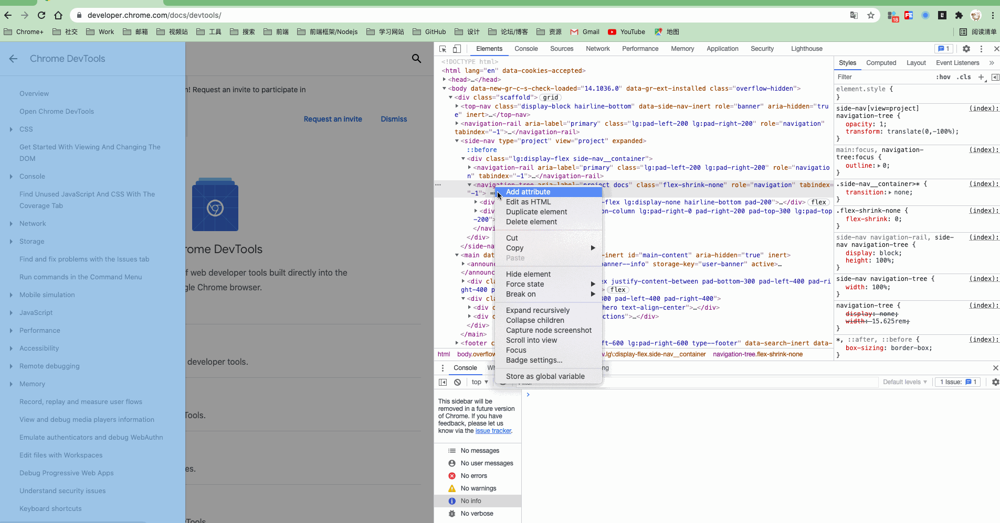
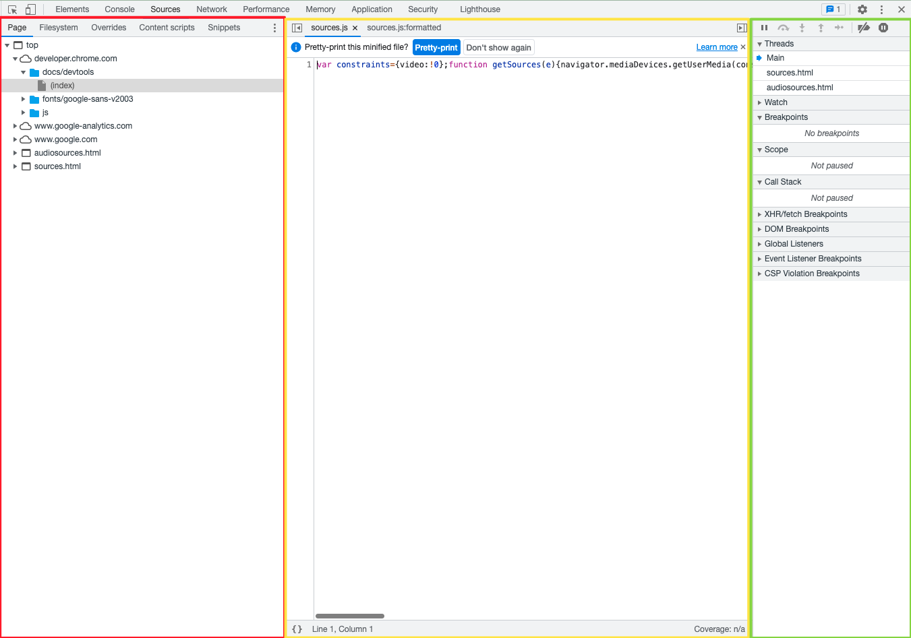
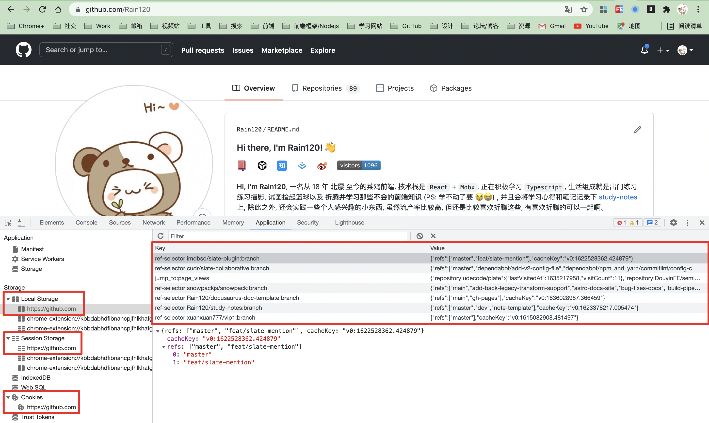

## 浏览器

### 调试页面的DOM和HTML

### 调试页面样式CSS

### 调试页面JavaScript及Log日志

### 断点调试

### 网络Network查看页面请求与分析

### 调试客户端存储

### 安装插件

Chrome 插件: Chrome 键入`chrome://extensions/`

[React](https://chrome.google.com/webstore/detail/react-developer-tools/fmkadmapgofadopljbjfkapdkoienihi)

[Vue](https://chrome.google.com/webstore/detail/vuejs-devtools/ljjemllljcmogpfapbkkighbhhppjdbg)

[Redux](https://chrome.google.com/webstore/detail/redux-devtools/lmhkpmbekcpmknklioeibfkpmmfibljd?hl=zh-CN)

[Mobx](https://chrome.google.com/webstore/detail/mobx-developer-tools/pfgnfdagidkfgccljigdamigbcnndkod)

#### 前端工具

[FeHelper(前端助手)](https://chrome.google.com/webstore/detail/fehelper%E5%89%8D%E7%AB%AF%E5%8A%A9%E6%89%8B/pkgccpejnmalmdinmhkkfafefagiiiad)

#### 接口测试

[Postman](https://chrome.google.com/webstore/detail/postman/fhbjgbiflinjbdggehcddcbncdddomop)

更多插件详见: here // TODO: 等新版本

### 参考资料

[Chrome DevTools](https://developer.chrome.com/docs/devtools/)

[Chrome DevTools开发者工具调试指南](https://www.imooc.com/learn/1164)

