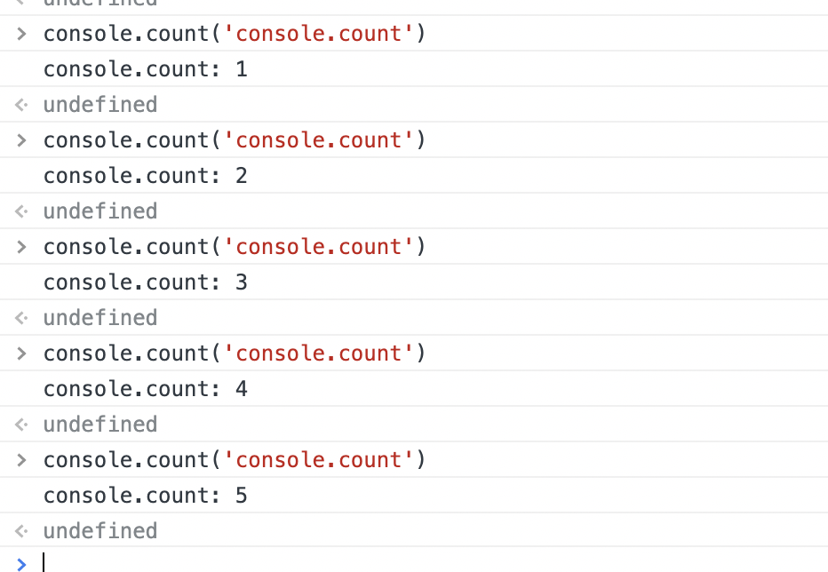
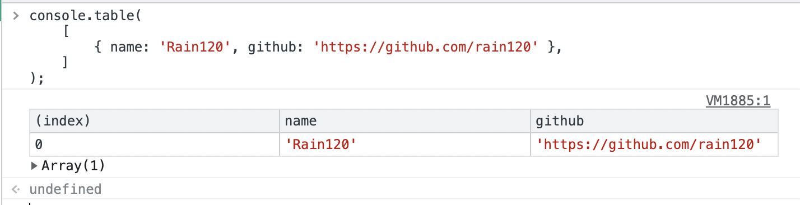
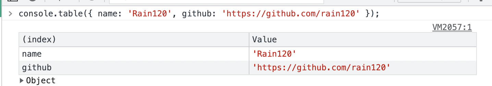
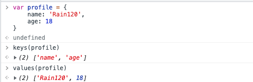
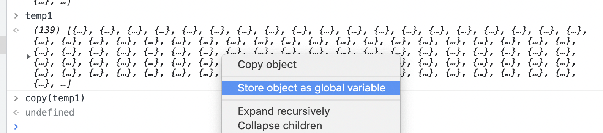
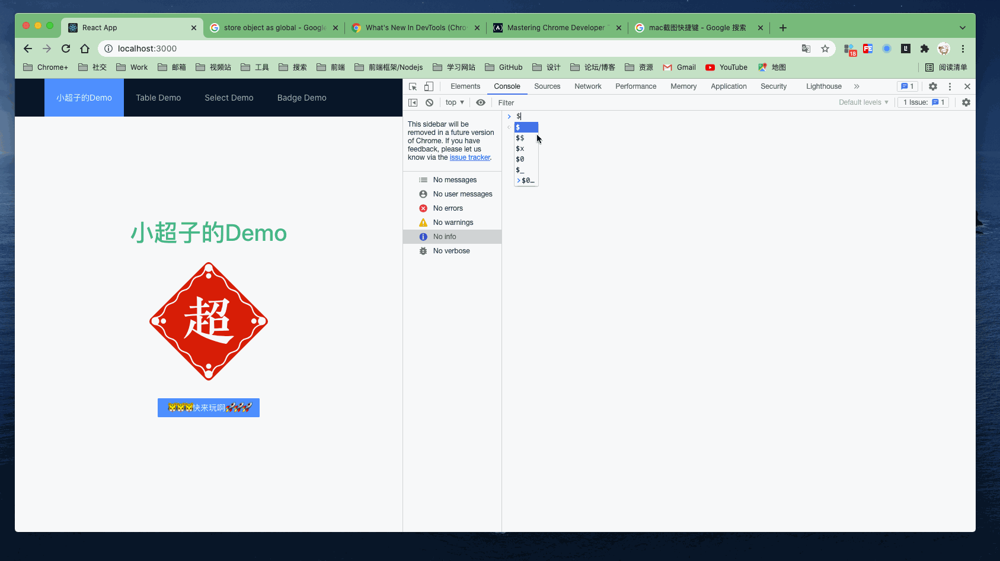
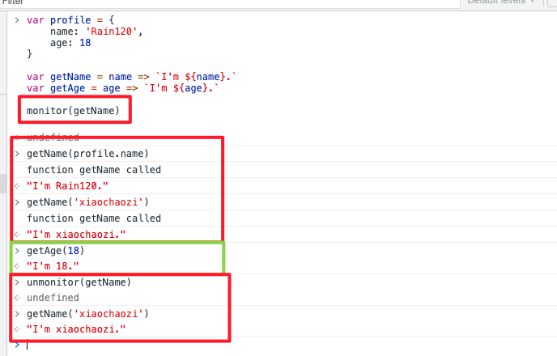
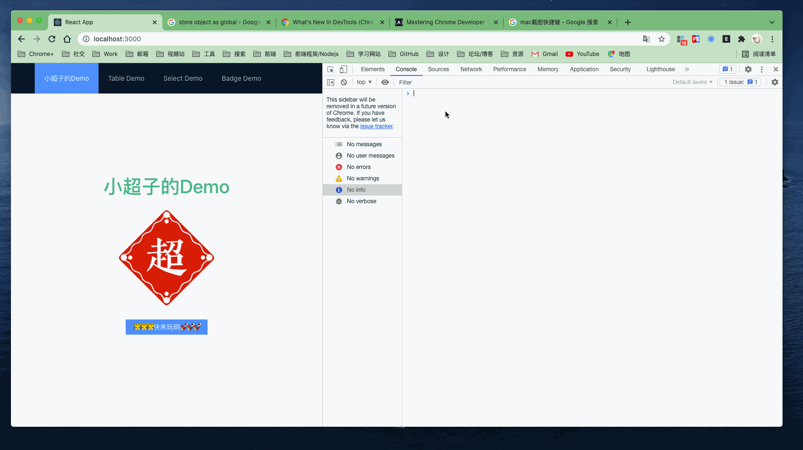
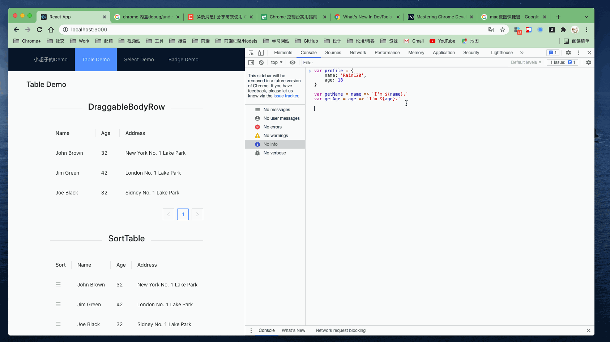

### console

#### console.time() && console.timeEnd()

分析函数的性能

#### console.count

记录一个函数或则一段代码重复执行了多少次

#### console.trace

打印的数据的 `stacktrace`。

#### console.table

将对象以表格的形式打印出来

#### API工具方法

##### keys/values

#### Store as global variable

#### copy

快速拷贝一个对象为字符串表示方式到剪切板

#### monitorEvents/unmonitorEvents

可以观察DOM的触发事件

#### monitor/unmonitor

用来观察函数调用的工具方法。在函数调用的时候，可以同步输出函数名以及参数。

#### getEventListeners

获取注册到一个DOM上的所有事件监听器

#### debug/undebug

### 参考资料

[console全家桶](./javascript/console/console-related-note.md)

[Chrome Console Api](https://developer.chrome.com/docs/devtools/console/api/)

[Chrome Console utils API参考](https://developer.chrome.com/docs/devtools/console/utilities/)

