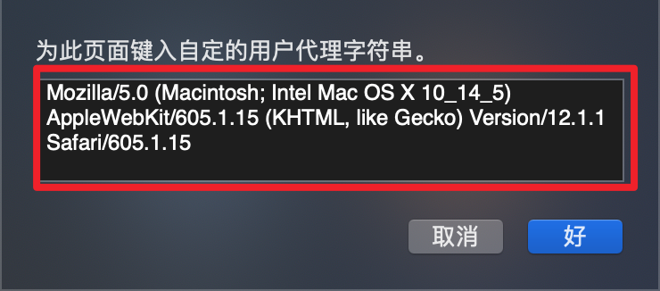
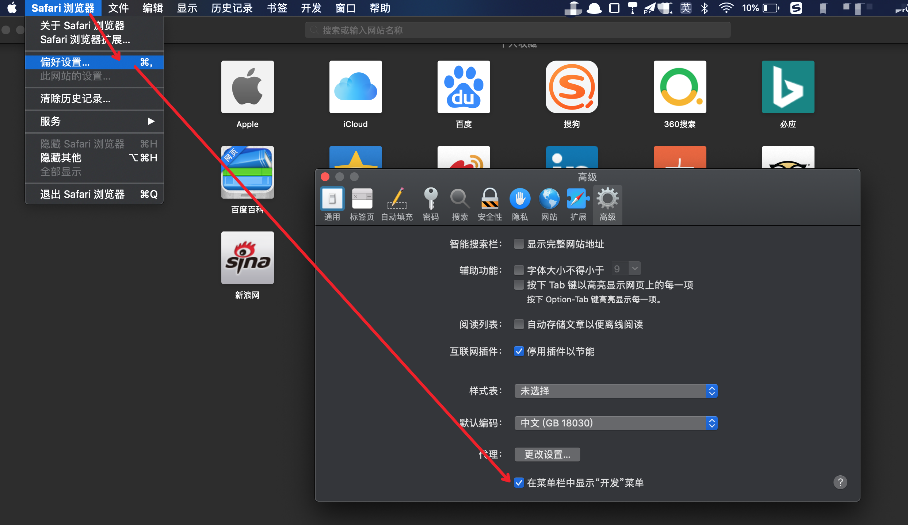
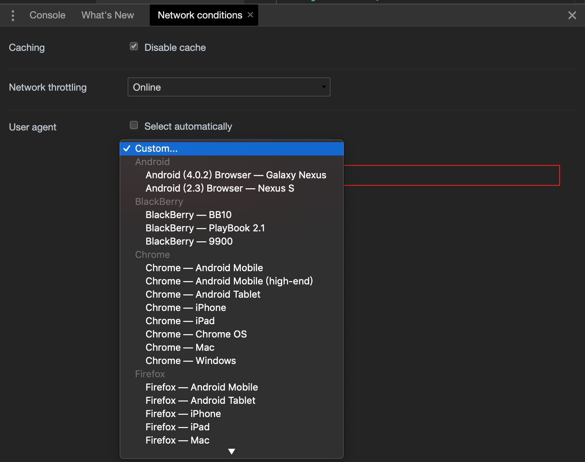
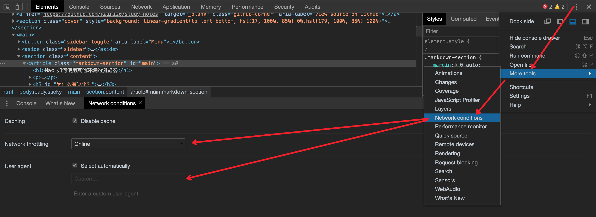

## 为什么有这个？

对于前端开发者而言，浏览器是必不可少的一部分，但是浏览器的兼容性问题也是所有开发的弊端，所以总是在自己的电脑安装各种版本的浏览器，特别是`Mac`，更难受了， 本文将介绍在 `Mac` 如何使用**不同版本**，**不同环境**的浏览器

**Note**: 能解决一些因为`user-agent`问题导致的`bug`。

## 如何使用

### Safari

```
Mac Safari -> 开发 -> 用户代理

// or

Mac Safari -> Develop -> User Agent
```


**自定义不同的User Agent**

```
Mac -> 开发 -> 用户代理 -> 其他
```



#### Mac 如何打开开发选项



### Chrome



#### Chrome



[常见的 User Agent](./browser-user-agent.md)

### 参考

[User-Agent](https://developer.mozilla.org/zh-CN/docs/Web/HTTP/Headers/User-Agent)

