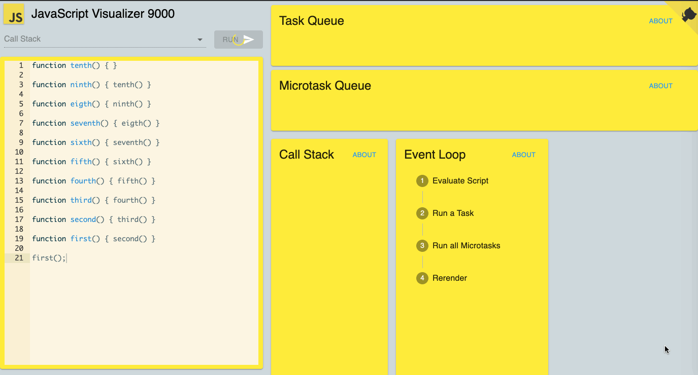

# 执行上下文

:::warning
此笔记有很多问题, 导致笔者有些混乱, 待笔者有空Review并重新整理
:::

## 前言

想要了解 `EC`，需要先了解一下几个概念

- [作用域链`(Scope chain)`](./scope-chain)
- 执行上下文`(Execution Context or EC)`
- 执行环境栈 `(Execution Context Stack or ECS)`
- 变量对象`(Variable object，VO)`
- 活动对象`(Activation object，AO)`

## 作用域链 (Scope chain)

[详见](./scope-chain)

## 执行上下文 (Execution Context or EC)

执行上下文`(EC)`是评估和执行 `JavaScript` 代码的环境的抽象概念。每当 `Javascript` 代码在运行的时候，它都是在执行上下文中运行。

### 生命周期

执行上下文的生命周期包括三个阶段：**创建阶段👉执行阶段👉回收阶段**。

**创建阶段**

 `(ECMA 3 规范)`

- 创建变量对象 **(当前执行上下文)**
  - 创建`arguments`对象
    - 检查上下文，初始化参数名称和值并创建引用的复制
  - 创建函数声明 (存在的话)
    - 以函数声明的名字在[变量对象](#变量对象-variable-object，vo) 上创建一个属性，并指向函数存放的引用地址
    - **若遇到重复的函数名，将覆盖上一次引用地址**
  - 创建变量 (存在的话)
    - 以变量名在[变量对象](#变量对象-variable-object，vo) 上创建一个属性，并给当前变量赋值为`undefined`
    - **若遇到重复的变量名，不进行任何相关赋值操作，继续下一步**
- 建立作用域链
- 确定`this`指向
  - 更多`this` 指向问题详见 [Javascript this](./this)

 `(ECMA 5 规范)`

- 确定`this`指向

  - 更多`this` 指向问题详见 [Javascript this](./this)

- 创建词法环境 `(Lexical Environment)`

  > A *Lexical Environment* is a specification type used to define the association of *Identifiers* to specific variables and functions based upon the lexical nesting structure of ECMAScript code. A Lexical Environment consists of an [Environment Record](https://www.ecma-international.org/ecma-262/5.1/#sec-10.2.1) and a possibly null reference to an *outer* Lexical Environment. Usually a Lexical Environment is associated with some specific syntactic structure of ECMAScript code such as a *FunctionDeclaration*, a *WithStatement*, or a *Catch* clause of a *TryStatement* and a new Lexical Environment is created each time such code is evaluated.

  词法环境是一种规范类型，用于根据`ECMAScript`代码的词法嵌套结构来定义标识符与特定变量和函数的关联。 词法环境由环境记录和对外部词法环境的可能为空的引用组成。 通常，词法环境与`ECMAScript`代码的某些特定语法结构（如`FunctionDeclaration`，`WithStatement`或`TryStatement`的`Catch`子句）相关联，并且每次评估此类代码时都会创建一个新的词法环境。

- 创建变量环境 `(Variable Environment)`

  > Identifies the [Lexical Environment](https://www.ecma-international.org/ecma-262/5.1/#sec-10.2) whose environment record holds bindings created by *VariableStatements* and *FunctionDeclarations* within this execution context.

  标识词法环境，该词法环境的环境记录包含此执行上下文中`VariableStatements`和`FunctionDeclarations`创建的绑定。

**执行阶段**

- 变量赋值
- 函数引用
- 执行其他代码

**回收阶段**

执行完毕出栈，等待被虚拟机回收


### 执行上下文类型

`JavaScript` 中有三种执行上下文类型。

- **全局执行上下文** `(global)`

  默认任何不在函数内部的代码都在全局上下文中。它会执行两件事：创建一个全局的 `window` 对象（浏览器的情况下），并且设置 `this`的值等于这个全局对象。一个程序中只会有一个全局执行上下文。

- **函数执行上下文** `(function)`

  每当一个函数被调用时, 都会为该函数创建一个新的上下文。每个函数都有它自己的执行上下文，不过是在函数被调用时创建的。函数上下文可以有任意多个。每当一个新的执行上下文被创建，它会按定义的顺序执行一系列步骤。

- **Eval 函数执行上下文** `(Eval)`

  执行在 `eval`函数内部的代码也会有它属于自己的执行上下文。

## 执行上下文栈 (Execution Context Stack or ECS)

也称**调用栈**, 是一种拥有 `LIFO(后进先出)`数据结构的栈，被用来存储代码运行时创建的所有**执行上下文**。 它是一种记录保存结构，允许我们执行函数调用。 每个函数调用在调用堆栈上都表示为一个框架。 这就是`JavaScript`引擎跟踪已调用哪些函数以及调用顺序的方式。 `JS`引擎使用此信息来确保函数返回后在正确的位置重新执行。

当`JavaScript`程序首次开始执行时，调用栈为空。 进行第一个函数调用时，新的框架将被推到调用堆栈的顶部。 当该函数返回时，其框架从调用堆栈弹出。



## 变量对象 (Variable object，VO)

> Every execution context has associated with it a variable object. Variables and functions declared in the source text are added as properties of the variable object. For function code, parameters are added as properties of the variable object.
>
> --- [Standard ECMA-262 3r d Edition - December 1999 - 10.1.3 Variable Instantiation](http://www.ecma-international.org/publications/files/ECMA-ST-ARCH/ECMA-262,%203rd%20edition,%20December%201999.pdf)

每一个执行上下文都会分配一个变量对象`(variable object)`，变量对象的属性由 **变量**`(variable)` 和 **函数声明**`(function declaration)` 构成。在函数上下文情况下，**参数列表**`(parameter list)`也会被加入到变量对象`(variable object)`中作为属性。变量对象与当前作用域息息相关。不同作用域的变量对象互不相同，它保存了当前作用域的所有函数和变量。

`VO`初始化阶段会将👇👇👇内容依次初始化到`VO`上，与👆👆👆[执行上下文的生命周期](#生命周期)创建过程一致。

- 函数形参 `(function arguments)`
- 函数声明`(FunctionDeclaration, FD)`，注意函数声明与**函数表达式**的区别。
- 变量声明 `(var, VariableDeclaration)`

**Note:** 函数声明先于变量声明

## 活动对象 (Activation object，AO)

> When control enters an execution context for function code, an object called the activation object is created and associated with the execution context. The activation object is initialised with a property with name arguments and attributes { DontDelete }. The initial value of this property is the arguments object described below.
>
> The activation object is then used as the variable object for the purposes of variable instantiation.
>
> --- [Standard ECMA-262 3r d Edition - December 1999 - 10.1.6 Activation Object](http://www.ecma-international.org/publications/files/ECMA-ST-ARCH/ECMA-262,%203rd%20edition,%20December%201999.pdf)

当控制进入函数代码的执行上下文时，创建一个活动对象并将它与该执行上下文相关联， 并使用一个名为 `arguments`、特征为 `{ DontDelete }` 的属性初始化该对象。该属性的初始值是稍后将要描述的一个参数对象`Arguments Object(简称ArgO)`。 活动对象纯粹是一种规范性机制，在 `ECMAScript` 访问它是不可能的。只能访问其成员而非该活动对象本身。对一个基于对象为活动对象的引用值应用调用运算符时，这次调用的 `this` 值为` null`。

**当函数被激活，那么一个活动对象(activation object)就会被创建并且分配给执行上下文。活动对象由特殊对象 arguments 初始化而成。随后，它被当做变量对象(variable object)用于变量初始化。**

## 举个🌰

```javascript
var name = 'Rain';

function getName(firstName) {
	var lastName = 120;
  
    var test = function func() {};

    function realName() {
        var goal = 10;
        return firstName + lastName;
    }

    return realName();
}

var realName = getName(name);

alert(realName);
```

**Note:** 先在创建阶段 `VO` 再到激活阶段 `AO`

`Global EC`

```javascript
VO = {
  scopChain： {...},
  variableObject: {
    window: global object,
    this: undefined,
    name: undefined,
    getName: fn() reference address,
    realName: fn() reference address,
  },
  activationObject: {
    window: global object,
    name: 'Rain',
    getName: fn() reference address,
    realName: fn() reference address,
  },
  this: window
}
```

`getName EC `

```javascript
VO = {
    scopChain： {...},
    variableObject: {
        arguments: { 0: undefined, length: 1 }
        lastName: undefined,
        test: fn() reference address,
        realName: fn() reference address,
        firstName: undefined,
   },
   activationObject: {
        arguments: { 0: 'Rain', length: 1 }
        lastName: '120',
        test: fn() reference address,
        realName: fn() reference address,
        firstName: 'Rain',
   },
   this: window
}
```

`realName EC `

```javascript
EC = {
    scopChain： {...},
    variableObject: {
        arguments: { length: 0 }
        goal: undefined,
    },
    activationObject: {
        arguments: { length: 0 }
        goal: 10,
   },
   this: window
}
```


## 总结

### 变量提升


### `this` 指向

更对详见 [Javascript this](./this)

## 参考资料

[Understanding Execution Context and Execution Stack in Javascript](https://blog.bitsrc.io/understanding-execution-context-and-execution-stack-in-javascript-1c9ea8642dd0)

[Lexical environments: ECMAScript implementation](http://dmitrysoshnikov.com/ecmascript/es5-chapter-3-2-lexical-environments-ecmascript-implementation/)

[Execution Contexts](https://www.ecma-international.org/ecma-262/5.1/#sec-10.3)

[execution context stack](https://tc39.es/ecma262/#execution-context-stack)

[ecmascript variable object](http://dmitrysoshnikov.com/ecmascript/chapter-2-variable-object/)

[javascriptthe core](http://dmitrysoshnikov.com/ecmascript/javascript-the-core/)

[调用栈](https://developer.mozilla.org/zh-CN/docs/Glossary/Call_stack)

[JavaScript 引擎基本原理：Shapes 和 Inline Caches](https://www.zcfy.cc/article/javascript-engine-fundamentals-shapes-and-inline-caches)


