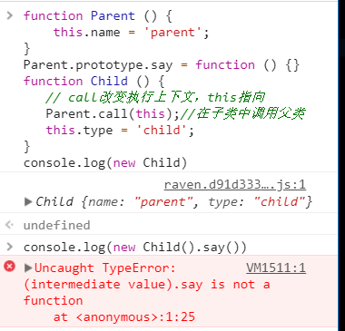
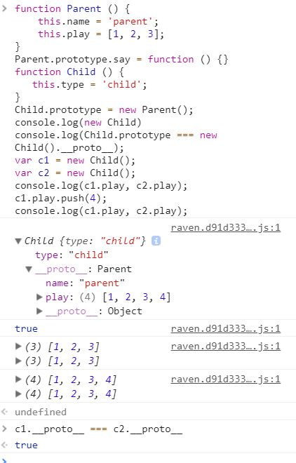
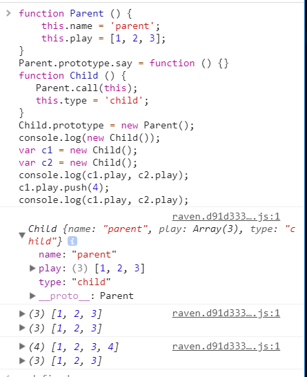
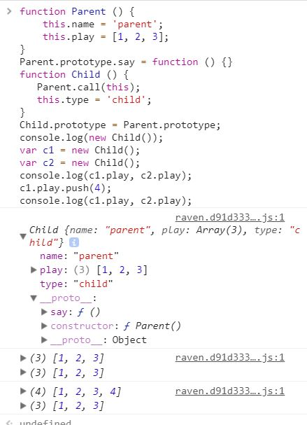
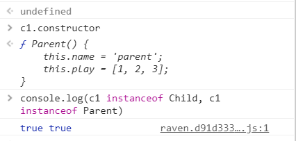
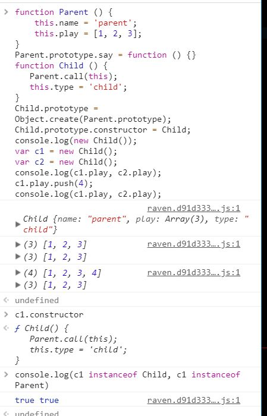

#### 借助构造函数实现继承

原理： 将父级构造函数的 `this` 指向子类

```js
function Parent () {
    this.name = 'parent';
}
Parent.prototype.say = function () {}
function Child () {
   // call改变执行上下文，this指向
   Parent.call(this);//在子类中调用父类
   this.type = 'child';
}
```



**总结：实现部分继承，但是无法继承父类的原型方法**

#### 借助原型链实现继承

原理：每个函数都有`prototype`属性(是个`Object`对象)，`prototype`是子类构造函数的属性，`Parent`的实例赋值给这个属性，即`new Child().__proto__ = Child.prototype = new Parent`

```js
function Parent () {
    this.name = 'parent';
    this.play = [1, 2, 3];
}
Parent.prototype.say = function () {}
function Child () {
   this.type = 'child';
}
Child.prototype = new Parent();
console.log(Child.prototype === new Child().__proto__);
var c1 = new Child();
var c2 = new Child();
console.log(c1.play, c2.play);
c1.play.push(4);
console.log(c1.play, c2.play);
```



**总结：继承的原型链引用同一个原型对象，多个实例更改其中一个会引起其他实例也发生更改。**

#### 组合方式继承

组合构造函数继承和原型链继承方式继承

```js
function Parent () {
    this.name = 'parent';
    this.play = [1, 2, 3];
}
Parent.prototype.say = function () {}
function Child () {
   Parent.call(this);
   this.type = 'child';
}
Child.prototype = new Parent();
console.log(new Child());
var c1 = new Child();
var c2 = new Child();
console.log(c1.play, c2.play);
c1.play.push(4);
console.log(c1.play, c2.play);
```



**总结：父类被执行了两次，出现不必要的冗余**

#### 组合继承优化方式

```js
function Parent () {
    this.name = 'parent';
    this.play = [1, 2, 3];
}
Parent.prototype.say = function () {}
function Child () {
   Parent.call(this);
   this.type = 'child';
}
Child.prototype = Parent.prototype;
console.log(new Child());
var c1 = new Child();
var c2 = new Child();
console.log(c1.play, c2.play);
c1.play.push(4);
console.log(c1.play, c2.play);
```





**总结：子类没有constructor，子类、父类共用一个原型类**

#### 组合继承优化方式2

`Object.create()` 方法会使用指定的原型对象及其属性去创建一个新的对象。

```js
function Parent () {
    this.name = 'parent';
    this.play = [1, 2, 3];
}
Parent.prototype.say = function () {}
function Child () {
   Parent.call(this);
   this.type = 'child';
}
Child.prototype = Object.create(Parent.prototype);
Child.prototype.constructor = Child;
console.log(new Child());
var c1 = new Child();
var c2 = new Child();
console.log(c1.play, c2.play);
c1.play.push(4);
console.log(c1.play, c2.play);
```



**总结: 完美解决上述所有的问题**

