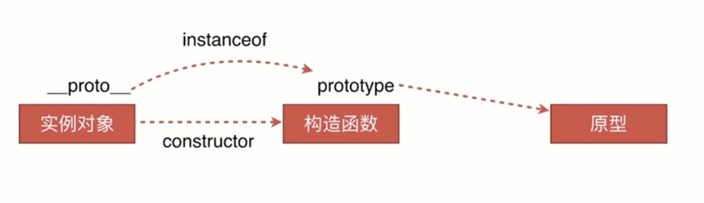

#### 定义

**instanceof** **运算符**用于检测构造函数的 `prototype` 属性是否出现在某个实例对象的原型链上。

#### 原理

判断实例对象的`__proto__`和构造函数的`prototype`是不是引用同一个地址



#### 实现

```js
function _instanceof(left, right) {
  const rt = right.prototype;
  let lt = left.__proto__;
  while (true) {
    if (lt === null) {
      return false;
    }
    if (lt === rt) {
      return true;
    }
    lt = lt.__proto__;
  }
}
var Fun = function (name) {
   this.name = name;
}
var obj = new Fun('Rainy');
console.log(obj);
console.log(obj.__proto__ === Fun.prototype);
```


#### 参考资料

[instanceof](https://developer.mozilla.org/zh-CN/docs/Web/JavaScript/Reference/Operators/instanceof)

