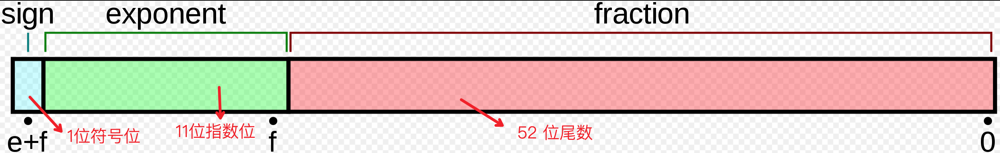

# Javascript 小数精度问题

## 精度丢失

### 小数

大家先思考下下面几个问题:

```javascript
0.1 + 0.2 = ? 0.3
0.07 * 100 = ? 7
1 - 0.9 = ? 0.1
```

`JavaScript` 的数字在存储时并不区分`number`和`float`类型，而是采用 [IEEE 754](https://zh.wikipedia.org/zh-cn/IEEE_754) **标准的 64 位双精度浮点数**来存储的。那么 **IEEE 754** 定义的**双精度浮点数**的格式是什么呢？

1. 了解 IEEE 754 格式

- 1 位符号位 `(sign)`
- 11 位指数位 `(exponent)`
- 52 位尾数位 `(fraction)`



2. 小数进制转换

我们知道**十进制**转换 其他 **进制** 分为 **整数转换**， **小数转换**

**整数**: 转换数值 **除以** 进制数 **取余**，放**后面**

**小数**: 转换数值 **乘以** 进制数 **取整数位**， 放**前面**

```javascript
# 0.1  十进制 -> 二进制
0.1 * 2 = 0.2  取0
0.2 * 2 = 0.4  取0
0.4 * 2 = 0.8  取0
0.8 * 2 = 1.6  取1
0.6 * 2 = 1.2  取1
0.2 * 2 = 0.4  取0
0.4 * 2 = 0.8  取0
0.8 * 2 = 1.6  取1
0.6 * 2 = 1.2  取1
.... n

# 0.1 = 0.0001 1001 1...
```

### 整数

```javascript
Number.MAX_SAFE_INTEGER = 9007199254740991 = Math.pow(2, 53) - 1

Number.MIN_SAFE_INTEGER = -9007199254740991 = -(Math.pow(2, 53) - 1)
```

整数在**安全值域内**`[-9007199254740991, 9007199254740991]`亦会如此

### 参考资料

[Wiki IEEE 754](https://zh.wikipedia.org/zh-cn/IEEE_754)

