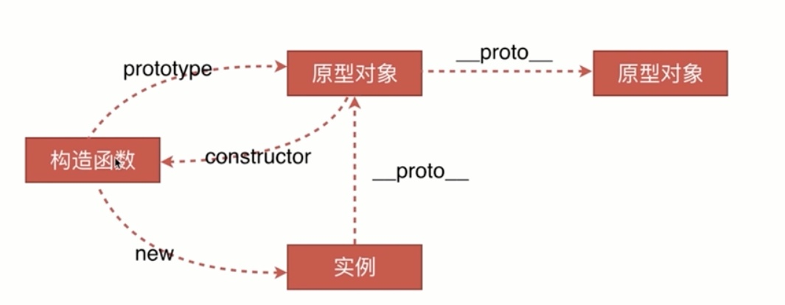
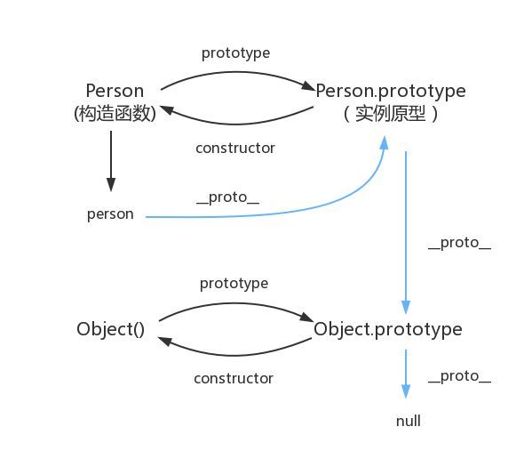

# 原型链

## 原型链

`JavaScript` 只有一种结构：对象。每个实例对象（ object ）都有一个私有属性（称之为 __proto__ ）指向它的构造函数的原型对象（**prototype** ）。该原型对象也有一个自己的原型对象( __proto__ ) ，层层向上直到一个对象的原型对象为 `null`。根据定义，`null` 没有原型，并作为这个**原型链**中的最后一个环节。

几乎所有 JavaScript 中的对象都是位于原型链顶端的 [`Object`](https://developer.mozilla.org/zh-CN/docs/Web/JavaScript/Reference/Global_Objects/Object) 的实例。

它包括四个部分：原型、构造函数、实例、原型链



例如

```js
// 构造函数 Person, 实例 person 关系如下

person = new Person()

person.__proto__ === Person.prototype 

Person.prototype.contructor === Person

Person.prototype.__proto__ === Object.prototype

```



## 原型链查找问题

```js
function Person() {};
Person.prototype.name = 'Rainy';

const person = new Person();
person.prototype.name = 'Rain120';

console.log(Person.prototype.name); // undefiend
console.log(person.prototype.name); // Rain120
```

**沿着原形链查找** 其实不是沿着 `prototype` 属性查找， 而是 `__proto__`

`Person` 是个函数，只能算`Function`的实例, 只有 `Person` 的实例才能访问得到

[javascript 给函数加了原型属性后，为什么用函数不能直接访问这个属性？代码如下： - Jim Liu的回答 - 知乎](https://www.zhihu.com/question/51820518/answer/127655677)

## 参考资料

[MDN - 继承与原型链](https://developer.mozilla.org/zh-CN/docs/Web/JavaScript/Inheritance_and_the_prototype_chain)

