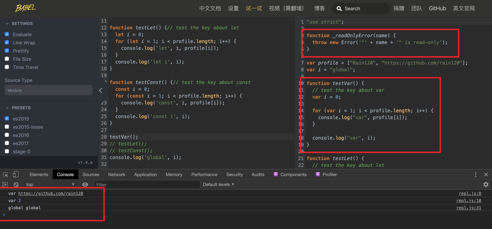
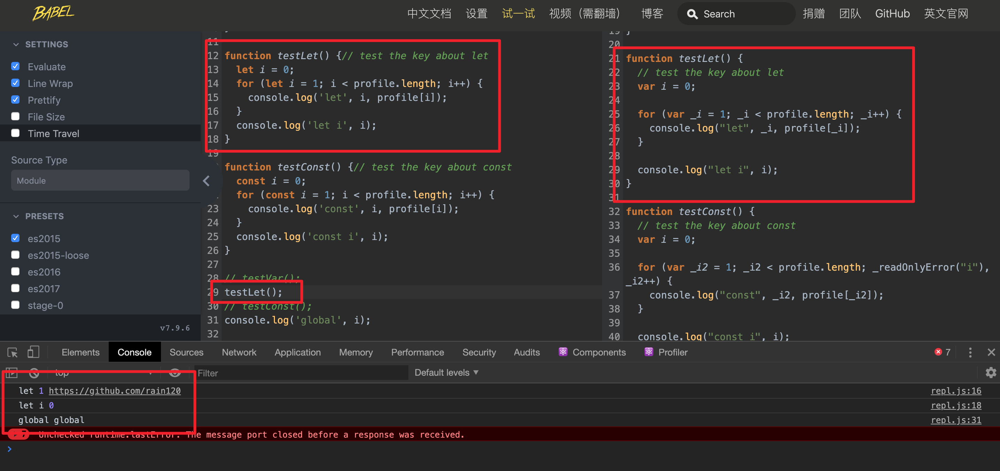
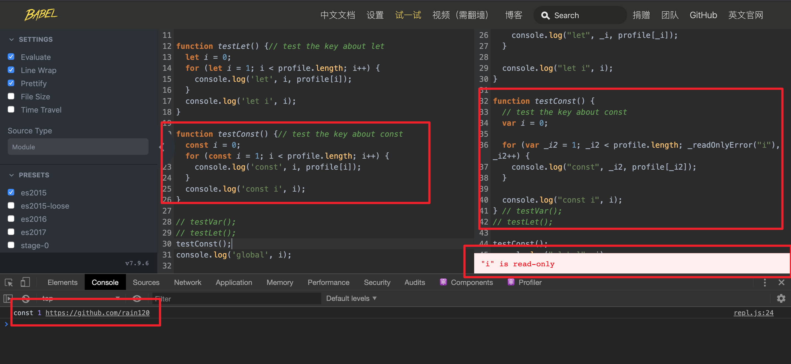
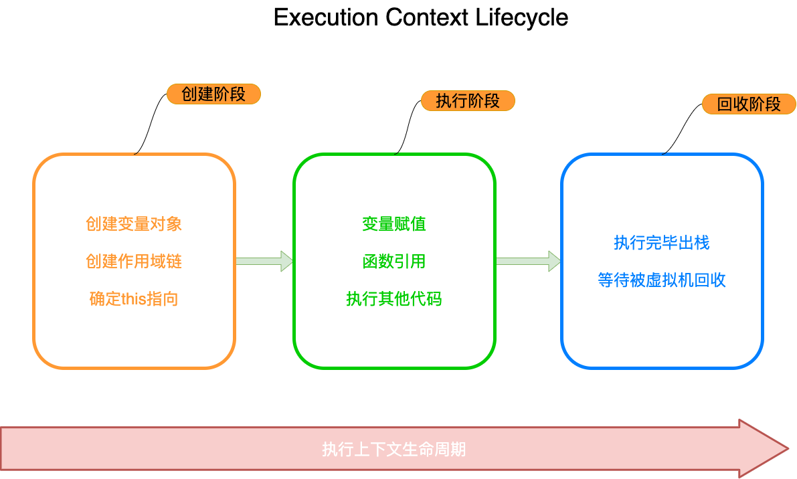

# 词法作用域链、函数作用域、块级作用域

:::warning
此笔记有很多问题, 导致笔者有些混乱, 待笔者有空Review并重新整理
:::

## 什么是变量？

变量是存储数据值的容器。在 `JavaScript` 中，对象和函数也是变量。

### 全局变量

函数之外声明的变量，会成为*全局变量*。

全局变量的作用域是*全局的*：网页的所有脚本和函数都能够访问它。

### 局部变量

在 `JavaScript` 函数中声明的变量，会成为函数的*局部变量*。

局部变量的作用域是*局部的*：只能在函数内部访问它们。

**Note:** 

`JavaScript `变量的有效期始于其被创建时。

局部变量会在函数完成时被删除。

全局变量会在您关闭页面是被删除。

## 什么是作用域?

变量和函数的**可访问范围**，即作用域控制着变量和函数的 **可见性** 和 **生命周期**。词法环境就是作用域。

`ES6`之前, `Javascript`只有 **全局作用域** 和 **局部作用域**, 之后新增了 **块级作用域**, 具体从[`let`](https://developer.mozilla.org/en-US/docs/Web/JavaScript/Reference/Statements/let) [`const`](https://developer.mozilla.org/en-US/docs/Web/JavaScript/Reference/Statements/const)中体现。

### 全局作用域(Global Scope)

不在任何函数内定义的变量就具有全局作用域。

- `window` 是**浏览器**的全局对象，`global` 是 `Node`环境下的全局对象
- 不在任何一个函数内定义的变量拥有全局作用域

### 局部作用域(Local Scope)

`JavaScript`的作用域是通过函数来定义的，所以每一个在函数内定义的变量只能拥有这个函数内的**局部作用域**  (除**闭包**外, 详见[Javascript 闭包](./closure.md))。

### 块级作用域(block Statement)

用于组合零个或多个语句，该块由一对大括号`{}`界定, 具体从[`let`](https://developer.mozilla.org/en-US/docs/Web/JavaScript/Reference/Statements/let) [`const`](https://developer.mozilla.org/en-US/docs/Web/JavaScript/Reference/Statements/const)中体现。

关于 `var ` `let` `const`的生命周期请移步 [var let const function 生命周期](./var-let-const-function-lifecycle.md)

**暂存死区**

在讲`let` `const`这两个关键字前，我们先讲一个概念 `TDZ(Temporal Dead Zone)`, 又称**暂存死区**。

定义: 在相同的函数或块作用域内重新声明同一个变量会引发SyntaxError; 也称 TDZ(Temporal dead zone)。

作用: 在声明变量或常量之前使用它, 会引发ReferenceError，即不能在初始化之前，使用变量。

### let

**let**允许你声明一个作用域被限制在 [`块`](https://developer.mozilla.org/zh-CN/docs/Web/JavaScript/Reference/statements/block)级中的变量、语句或者表达式。与 [`var`](https://developer.mozilla.org/zh-CN/docs/Web/JavaScript/Reference/statements/var) 关键字不同的是， [`var`](https://developer.mozilla.org/zh-CN/docs/Web/JavaScript/Reference/statements/var)声明的变量只能是全局或者整个函数块的。 [`var`](https://developer.mozilla.org/zh-CN/docs/Web/JavaScript/Reference/statements/var) 和 `let` 的不同之处在于后者是在编译时才初始化（[见下面](https://developer.mozilla.org/zh-CN/docs/Web/JavaScript/Reference/Statements/let#暂存死区)）。

**Note:** 

- `let has hoisting?`
  - 提升是变量在作用域顶部的耦合声明和初始化阶段，`let`生命周期分离声明和初始化阶段, 产生了**暂存死区**, 所以此时变量无法访问。

### const

常量是块级作用域，很像使用 [let](https://developer.mozilla.org/en-US/docs/Web/JavaScript/Reference/Statements/let) 语句定义的变量。常量的值不能通过重新赋值来改变，并且不能重新声明。

下面我们将边通过`babel`对`var` `let` `const`关键字的解析来理解`babel`对块级作用域的解析。反派总是死于话多，话不多说，我们直接上代码

```javascript
let profile = ['Rain120', 'https://github.com/rain120'];
var i = 'global';

function testVar() {
  // test the key about var
  var i = 0;
  for (var i = 1; i < profile.length; i++) {
   	console.log('var', profile[i]); 
  }
  console.log('var', i);
}

function testLet() {
  // test the key about let
  let i = 0;
  for (let i = 1; i < profile.length; i++) {
   	console.log('let', i, profile[i]); 
  }
  console.log('let i', i);
}

function testConst() {
  // test the key about const
  const i = 0;
  for (const i = 1; i < profile.length; i++) {
   	console.log('const', i, profile[i]); 
  }
  console.log('const i', i);
}

// testVar();
// testLet();
// testConst();
// console.log('global', i);
```

`babel`解析

```javascript
"use strict";

function _readOnlyError(name) {
  throw new Error('"' + name + '" is read-only');
}

var profile = ["Rain120", "https://github.com/rain120"];
var i = "global";

function testVar() {
  // test the key about var
  var i = 0;

  for (var i = 1; i < profile.length; i++) {
    console.log("var", profile[i]);
  }

  console.log("var", i);
}

function testLet() {
  // test the key about let
  var i = 0;

  for (var _i = 1; _i < profile.length; _i++) {
    console.log("let", _i, profile[_i]);
  }

  console.log("let i", i);
}

function testConst() {
  // test the key about const
  var i = 0;

  for (var _i2 = 1; _i2 < profile.length; _readOnlyError("i"), _i2++) {
    console.log("const", _i2, profile[_i2]);
  }

  console.log("const i", i);
} // testVar();
// testLet();
// testConst();
// console.log('global', i);

```

运行结果

- `testVar`

  

- `testLet`

  

- `testConst`

  

更多详情请移步 [babeljs playground](https://www.babeljs.cn/repl#?browsers=&build=&builtIns=false&spec=false&loose=false&code_lz=DYUwLgBADgTg9gMwJaggXggbQOQCUCGSAdgIwBMADNgDQTYAWYYUAzgFwD0HA5kmPQFcARgDoAxnAC2HGIVKVsAXQDcAKABu-GBCTo63YHCH5g2NaoQCiYsEjhEIYECzAA1LQAoAlBADeXR2dIfhAIAGsQAE8IfCE4AUhNGFUICCSdPQo1VIQ4bQ903QwSZQyAHmh4ZFARUCJuflKkAGpmn18U1IBICSIWOBrDbg9sJJpKxBQQTCRFL1LOgF9O3v7BuGHRrXGkedVliysbOwcnFwAZcG8_ALPg-lCI6Nj4yFAwTveMjCzO3PyvkUICVyhNqiBaiB6o0dK12p0ID17GsIUMRu8drRYJNQDM5gtUstUqsBqiNujwDodnsDpZrLZ7IEXABhZFga7-DhM-6PKIxOIJCCrD7EtnfCC_HJ5CAeYXikG6CrY8GQ6H0JpwvwIpF9Um1cnYYWYsFTPHzCBLFbIvVow1ipDUtQHW5BdwwbxqF0XK57L1gVl9dm-rkk9abAxGEyO1RAA&debug=false&forceAllTransforms=false&shippedProposals=false&circleciRepo=&evaluate=true&fileSize=false&timeTravel=false&sourceType=module&lineWrap=true&presets=es2015&prettier=true&targets=&version=7.9.6&externalPlugins=)

通过上述代码，我们知道块级作用域的作用范围只能在它定义的`{}`内部使用。

### 函数作用域

在函数内声明的所有变量在函数体内始终是可见的，可以在整个函数的范围内使用及复用。

## 什么是作用域链？

当查找变量的时候，会先从当前上下文的变量对象中查找，如果没有找到，就会从父级(词法层面上的父级)执行上下文的变量对象中查找，一直找到全局上下文的变量对象，也就是全局对象。这样由**多个执行上下文的变量对象构成的链表**就叫做作用域链。

:::tip
作用域链，是由当前环境与上层环境的一系列变量对象组成，它保证了当前执行环境对符合访问权限的变量和函数的有序访问。
:::

我们知道执行上下文的生命周期如下图示



更多关于**执行上下文、变量对象**等上述的相关问题请转到 [Javascript 执行上下文](./execution-context.md) 阅读。

**作用域链是由当前环境与上层环境的一系列变量对象组成，它保证对执行环境有权访问的所有变量和函数的有序访问。**

## 词法作用域

:::tip
**词法作用域** 就是指作用域是由代码中函数声明的位置来决定的，所以词法作用域是静态的作用域，通过它就能够预测代码在执行过程中如何查找标识符。 -- [参考](https://blog.poetries.top/browser-working-principle/guide/part2/lesson10.html#%E8%AF%8D%E6%B3%95%E4%BD%9C%E7%94%A8%E5%9F%9F)
:::

## 参考资料

[ECMA 262: sec-global-environment-records](https://www.ecma-international.org/ecma-262/6.0/#sec-global-environment-records)

[what-is-lexical-scope](https://stackoverflow.com/questions/1047454/what-is-lexical-scope)

[作用域 - Wiki](https://zh.wikipedia.org/zh-cn/作用域)

[块级作用域](https://developer.mozilla.org/en-US/docs/Web/JavaScript/Reference/Statements/block)

[const](https://developer.mozilla.org/en-US/docs/Web/JavaScript/Reference/Statements/const)

[let](https://developer.mozilla.org/en-US/docs/Web/JavaScript/Reference/Statements/let)

[Execution context and the call stack — visually illustrated by a slice of tasty cake](https://medium.com/free-code-camp/execution-context-and-the-call-stack-visually-illustrated-by-a-slice-of-tasty-cake-14f9a64dc460)

[Scope](https://developer.mozilla.org/zh-CN/docs/Glossary/Scope)

[JavaScript深入之作用域链](https://github.com/mqyqingfeng/Blog/issues/6)

[前端基础进阶（四）：作用域与作用域链](https://www.jianshu.com/p/9b984874776c)
