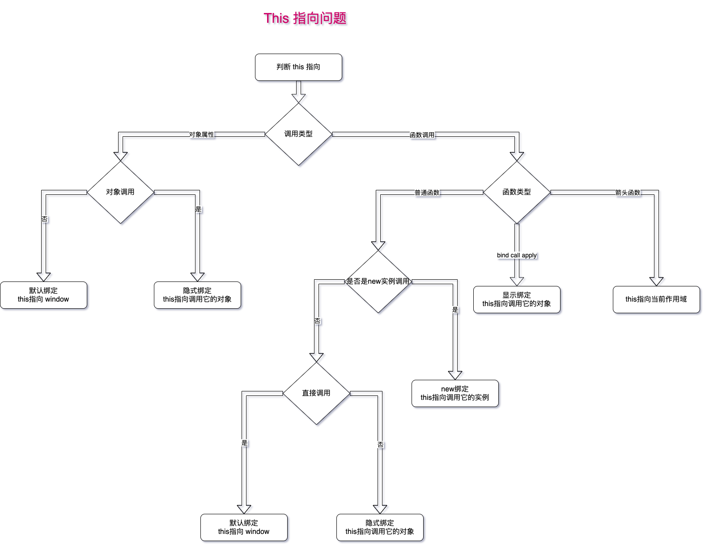

#### this 是什么？

`this`是 `JavaScript` 语言的一个关键字。

`this`指的是**函数运行时所在的环境**。它是函数运行时，在函数体内部自动生成的一个对象，只能在函数体内部使用。

#### 为什么会有this?

为了确定函数运行时所在的环境`(context)`。详见 [JavaScript 的 this 原理 - 阮一峰](https://www.ruanyifeng.com/blog/2018/06/javascript-this.html)。

#### 特性

`JavaScript` 中 `this` 不是固定不变的，它会**随着执行环境的改变而改变**。

**this 指向最终调用它的那个对象。**

#### this的绑定规则

##### 默认绑定

`this` 默认绑定到`window`

```javascript
let name = 'Rain120';
function getName() {
  console.log(this.name)   // 输出 Rain120
}

getName();
```


##### 隐式绑定

作为对象方法的调用, `this`会指向这个调用对象

```javascript
function getName() {
  console.log(this.name)   // 输出 Rain120
}

let user = {}

user.name = 'Rain120';
user.myName = getName;

user.myName();
```


##### 显式绑定

通过`call()`、`apply()`、`bind()`方法把对象绑定到`this`上, 更多详见 [call, apply, bind](./call-apply-bind.md)

```javascript
function getName() {
  console.log(this.name)   // 输出 Rain120
}

let user = {}

user.name = 'Rain120';
user.myName = getName;

user.myName.apply();
```


##### `new` 绑定

通过构造函数调用, 更多详情请到[JavaScript new](./new.md)

```javascript
function User() {
	this.name = 'Rain120'
}

let user = new User()
console.log(user.name)   // 输出 Rain120
```


##### 优先级

**new 绑定 > 显式绑定 > 隐式绑定 > 默认绑定**

#### 箭头函数

箭头函数表达式的语法比函数表达式更短，并且不绑定自己的`this`，`arguments`，`super`或 `new.target`。这些函数表达式最适合用于匿名函数`(non-method functions)`，并且它们不能用作构造函数。

- 没有 `this`, **需要通过查找作用域链来确定 this 的值**
- 没有 `arguments`, **箭头函数可以访问外部函数的 `arguments` 对象**
- 不能通过 `new`关键字调用，**箭头函数不能用作构造器，和 `new`一起用会抛出错误**
- 没有`new.target`值和`prototype`属性

#### this 指向终极解决方法



#### 参考资料

[Javascript 的 this 用法 - 阮一峰](http://www.ruanyifeng.com/blog/2010/04/using_this_keyword_in_javascript.html)

[箭头函数 MDN](https://developer.mozilla.org/zh-CN/docs/Web/JavaScript/Reference/Functions/Arrow_functions)


