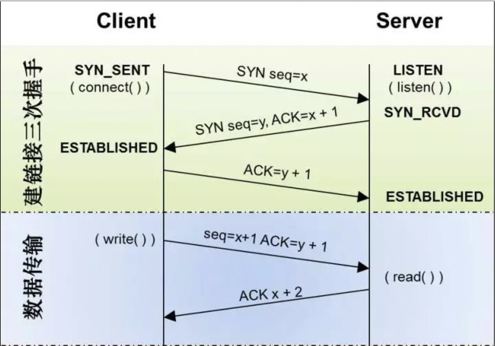
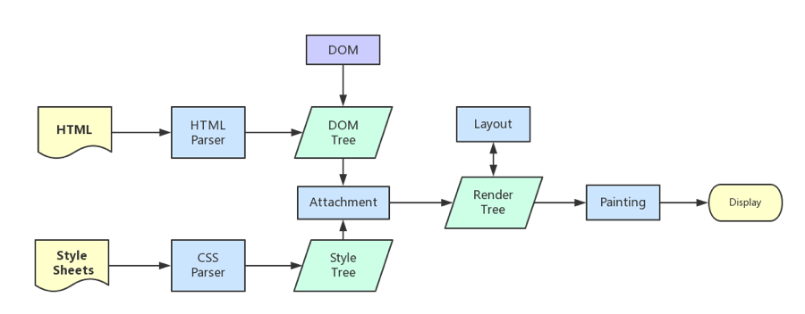
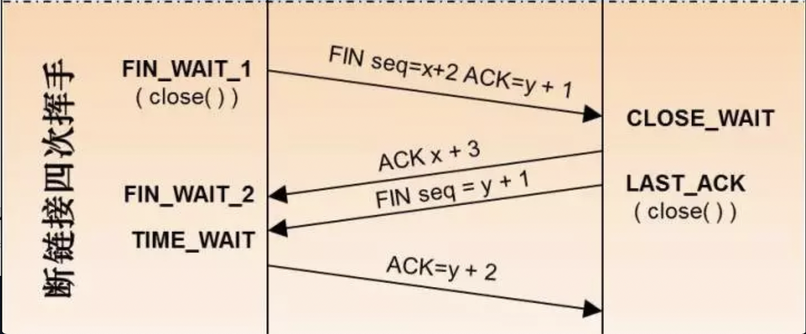
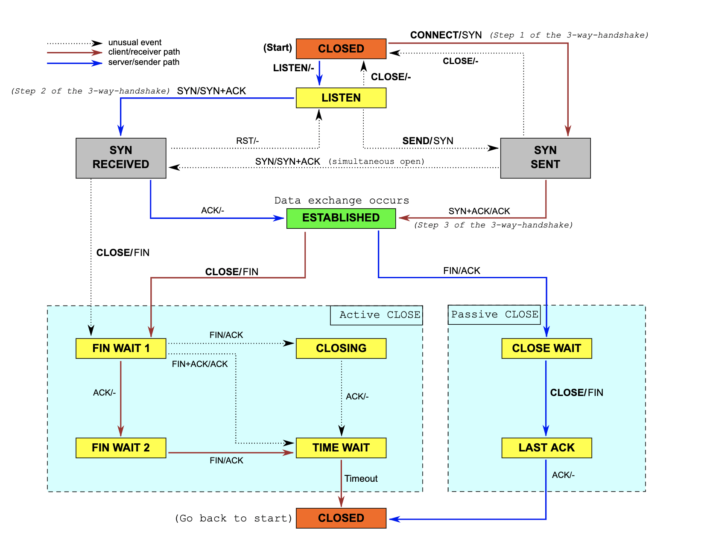

### TL;DR

- `DNS` 域名解析
- `HTTP`三次握手, `TCP` 连接
- 客户端发送请求
- 服务器响应资源
- 浏览器解析并渲染页面
- `HTTP` 四次挥手, 断开连接

#### 前置知识

**序列号`seq`：** 用来标记数据段的顺序，`TCP`把连接中发送的所有数据字节都编上一个序号，第一个字节的编号由本地随机产生；给字节编上序号后，就给每一个报文段指派一个序号；序列号`seq`就是这个报文段中的第一个字节的数据编号。

**确认号`ack`：** 期待收到对方下一个报文段的第一个数据字节的序号；序列号表示报文段携带数据的第一个字节的编号；而确认号指的是期望接收到下一个字节的编号；因此当前报文段最后一个字节的编号+1即为确认号。

**确认`ACK`：** 仅当`ACK=1`时，确认号字段才有效。`ACK=0`时，确认号无效

**同步`SYN`：** 连接建立时用于同步序号。当`SYN=1`，`ACK=0`时表示：这是一个连接请求报文段。若同意连接，则在响应报文段中使得`SYN=1`，`ACK=1`。因此，`SYN=1`表示这是一个连接请求，或连接接受报文。`SYN`这个标志位只有在`TCP`建产连接时才会被置1，握手完成后`SYN`标志位被置0。

**终止`FIN`：** 用来释放一个连接。`FIN=1`表示：此报文段的发送方的数据已经发送完毕，并要求释放运输连接

### DNS 解析

`TODO`

### 三次握手

#### 为什么要三次握手

**为了防止已失效的连接请求报文段突然又传送到了服务端，因而产生错误。**

谢希仁《计算机网络》书中的举例：

> “已失效的连接请求报文段”的产生在这样一种情况下：`client`发出的第一个连接请求报文段并没有丢失，而是在某个网络结点长时间的滞留了，以致延误到连接释放以后的某个时间才到达`server`。本来这是一个早已失效的报文段。但`server`收到此失效的连接请求报文段后，就误认为是`client`再次发出的一个新的连接请求。于是就向`client`发出确认报文段，同意建立连接。假设不采用“三次握手”，那么只要`server`发出确认，新的连接就建立了。由于现在`client`并没有发出建立连接的请求，因此不会理睬`server`的确认，也不会向`server`发送数据。但`server`却以为新的运输连接已经建立，并一直等待`client`发来数据。这样，`server`的很多资源就白白浪费掉了。采用“三次握手”的办法可以防止上述现象发生。例如刚才那种情况，`client`不会向`server`的确认发出确认。`server`由于收不到确认，就知道`client`并没有要求建立连接。”

所以主要目的防止server端一直等待，浪费资源。

### 客户端发送请求

`TODO`

### 服务器响应资源

`TODO`

### 浏览器解析并渲染页面

浏览器的渲染过程主要包括以下几步：

1. 解析`HTML`生成`DOM`树。
2. 解析`CSS`生成`CSSOM`规则树。
3. 将`DOM`树与`CSSOM`规则树合成在一起生成渲染树。
4. 遍历渲染树开始布局，计算每个节点的位置等信息。
5. 将渲染树每个节点绘制到页面。

### 四次挥手

#### 为什么要四次挥手？

`TCP`是全双工模式，这就意味着，当主机1发出`FIN`报文段时，只是表示主机1已经没有数据要发送了，主机1告诉主机2，它的数据已经全部发送完毕了；但是，这个时候主机1还是可以接受来自主机2的数据；当主机2返回`ACK`报文段时，表示它已经知道主机1没有数据发送了，但是主机2还是可以发送数据到主机1的；当主机2也发送了FIN报文段时，这个时候就表示主机2也没有数据要发送了，就会告诉主机1，我也没有数据要发送，之后就会中断这次`TCP`连接。

#### 状态转换

### 参考资料

[渲染页面：浏览器的工作原理](https://developer.mozilla.org/zh-CN/docs/Web/Performance/%E6%B5%8F%E8%A7%88%E5%99%A8%E6%B8%B2%E6%9F%93%E9%A1%B5%E9%9D%A2%E7%9A%84%E5%B7%A5%E4%BD%9C%E5%8E%9F%E7%90%86)

[在 PageSpeed Insights 中针对网站进行移动设备浏览体验分析](https://developers.google.com/speed/docs/insights/mobile)

[回流与重绘：CSS性能让JavaScript变慢？](https://www.zhangxinxu.com/wordpress/2010/01/%E5%9B%9E%E6%B5%81%E4%B8%8E%E9%87%8D%E7%BB%98%EF%BC%9Acss%E6%80%A7%E8%83%BD%E8%AE%A9javascript%E5%8F%98%E6%85%A2%EF%BC%9F/)

[TCP 三次握手、四次挥手](https://lotabout.me/2019/TCP-connection-establish-and-termination/)

