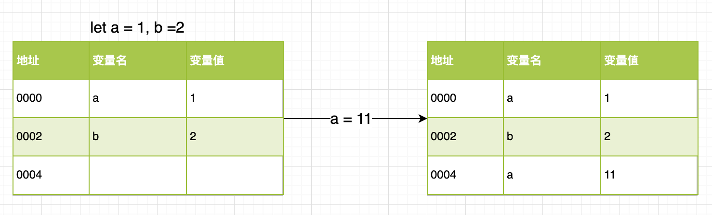
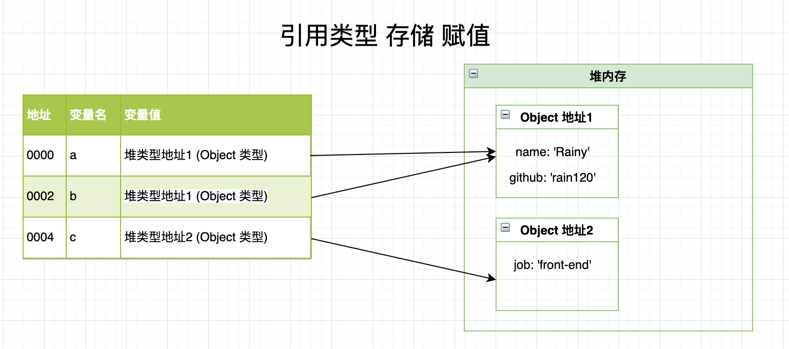
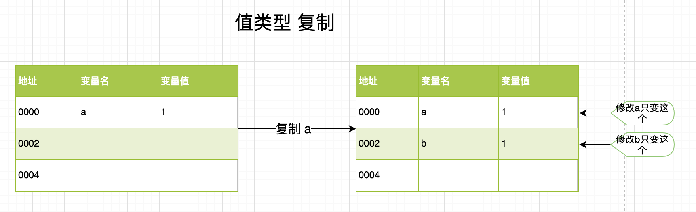
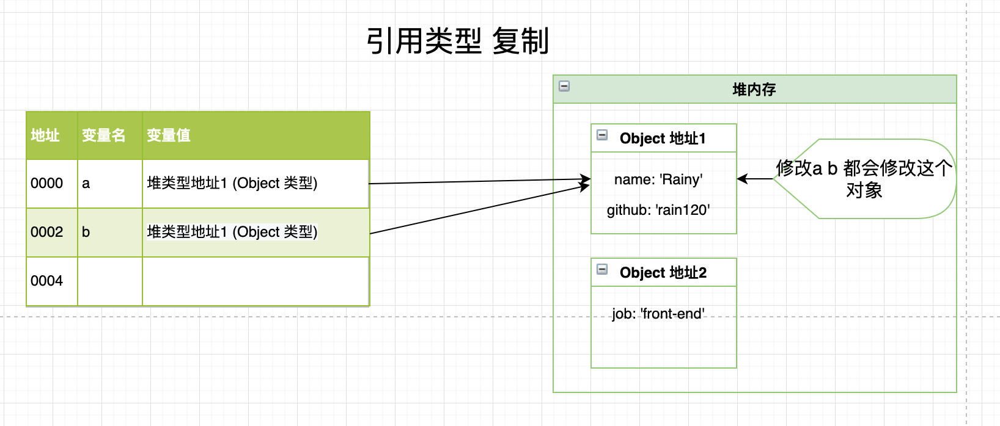

## 区别

### 1. **可变性**

**值类型的数据是不可变(immutable)的。**指值本身，一旦创建，便不可更改。

值类型是存储在堆内存中。

```javascript
let a = 1, b = 2;
a = 11;
```




**常见类型**: `number`, `string`, `null`, `undefined`, `boolean`, `symbol`

**引用类型值是可以改变的。**

引用类型的值是将变量名称和引用地址存储 保存在**堆内存** `(Heap)` 中的对象 `(Object)`。

```javascript
let a = { name: 'Rainy' };
let b = a;
b.github = 'Rain120'
let c = { job: 'front-end' };
```



**常见类型**: 对象`object`, 函数 `function`, 数组`array`, 类型的包装函数`Object` `Array` `Number`  `String` `Boolean`,  `Math` `Date` `RegExp` 库函数等

**Note**: `JavaScript` 不能直接操作对象的内存空间 **(堆内存)**。

### 2. **复制**

**值类型复制是值本身复制**

```javascript
let a = 1;
let b = a;
```



**引用类型复制是值的引用复制**

```javascript
let a = { name: 'Rainy' }
let b = a;
b.github = 'Rain120'
```



**Note:**

- 函数传递的参数是**引用类型**时，函数的参数是传入的参数的引用，所以**函数内部操作参数**会对传入的参数造成副作用
- `==` 和 `===`对引用类型的值判断结果是一样的，不准确。

## 对象引用

对象引用就是将一个**引用类型的值**复制给 **另一个变量**，实际上就是将 **引用类型的堆地址** 复制给新变量。

详细见上图
