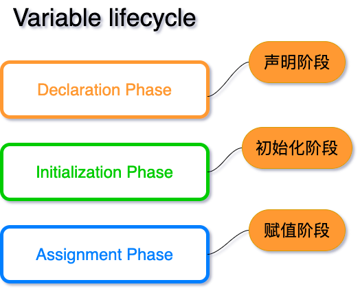
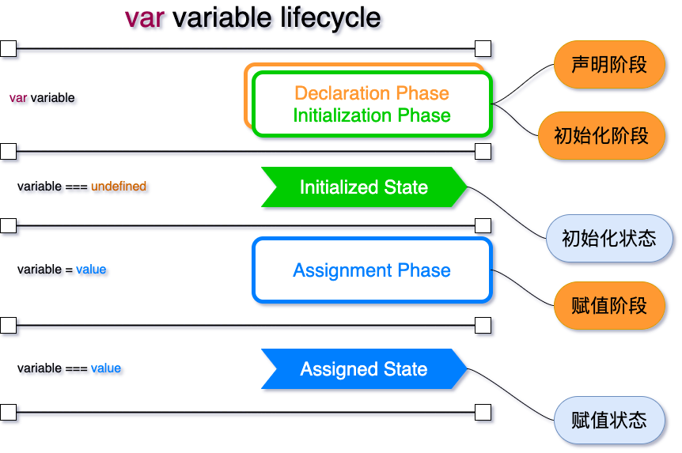
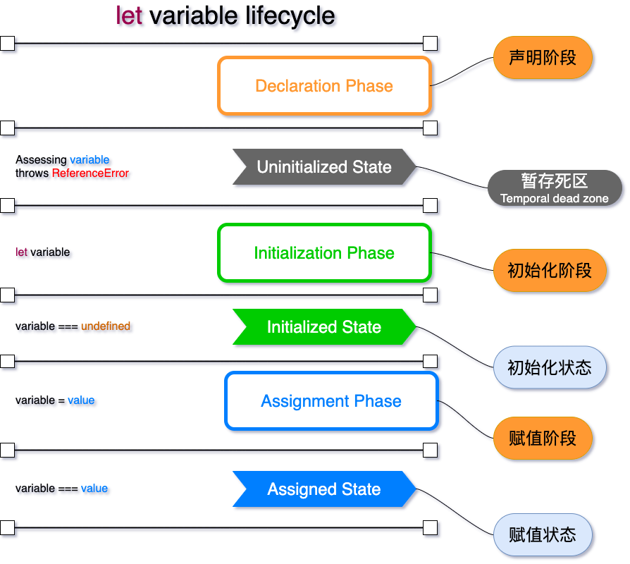
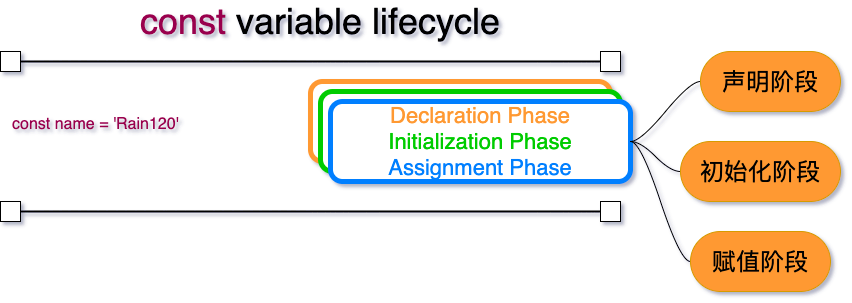
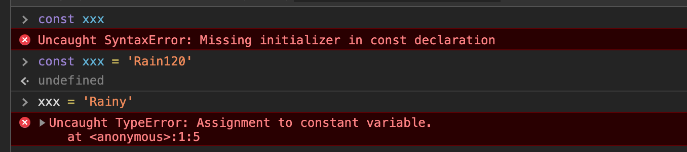
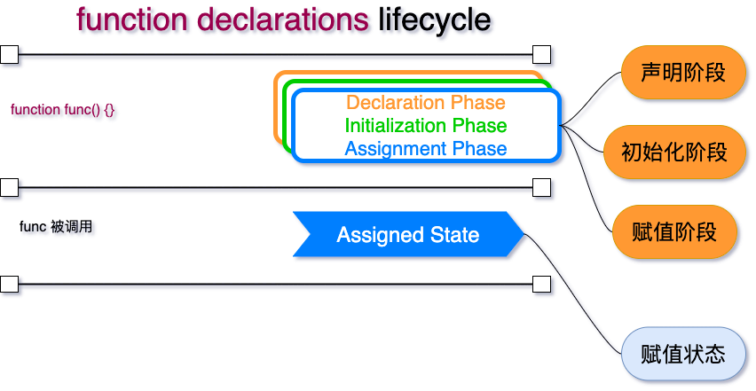
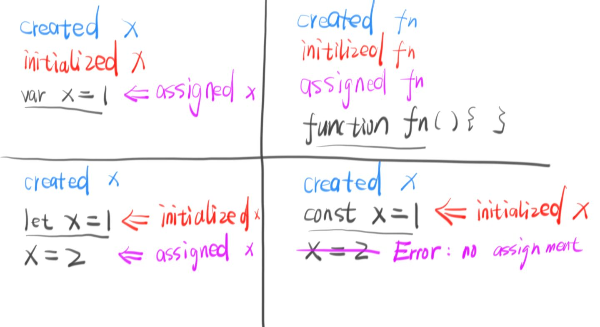

# var let const function 生命周期
## 前言

我们知道，当`Javascript`引擎使用变量时，生命周期包括以下几个阶段：

1. **声明阶段**正在范围内注册变量。
2. **初始化阶段**是分配内存并为作用域中的变量创建绑定。在此步骤中，变量将使用进行自动初始化`undefined`。
3. **分配(assign)阶段**是为初始化变量分配一个值。

变量在通过声明阶段时已**处于统一**状态，但尚未达到**初始化**状态。

即: **声明阶段**，**初始化阶段**和**赋值阶段**。

## var变量生命周期

在执行任何语句之前，变量在作用域的开头通过**声明阶段**并立即**初始化阶段**（步骤1）。 `var variable`语句在函数作用域中的位置不影响声明和初始化阶段。

在声明和初始化之后，但是在赋值阶段之前，该变量具有`undefined`值并且可以被使用。

在**赋值阶段** `variable = 'value'`，变量将接收其初始值（步骤2）。

严格**提升**`(将变量或函数定义移动到作用域头部的过程)`的思想是，在函数作用域的**开始处声明和初始化** 变量。声明和初始化阶段之间没有差距。

## let 变量生命周期

`let`和`var`的区别在于声明和初始化阶段是**分开的**。变量在声明后，初始化之间，会存放在一个暂存死区之中。

那什么是**暂时死区**呢？有什么作用呢？

**定义:** 在相同的函数或块作用域内重新声明同一个变量会引发`SyntaxError`; 也称 `TDZ(Temporal dead zone)`。

**作用:** 在声明变量或常量之前使用它, 会引发`ReferenceError`，即不能在初始化之前，使用变量。

## const 变量生命周期

`const`和`class` 类型与`let`具有相同的生命周期，只是分配只能发生一次`(声明时候必须初始化)`。

## function 声明生命周期

在定义函数时，声明、初始化和赋值阶段同时发生，所以可以在作用域内的任何地方调用函数，即函数变量会**提升**。

## 四种声明方式

## 参考资料

[variables-lifecycle-and-why-let-is-not-hoisted](https://dmitripavlutin.com/variables-lifecycle-and-why-let-is-not-hoisted)

[Quick Tip: How to Declare Variables in JavaScript](https://www.sitepoint.com/how-to-declare-variables-javascript/)

[我用了两个月的时间才理解 let](https://zhuanlan.zhihu.com/p/28140450)

[are-variables-declared-with-let-or-const-not-hoisted-in-es6](https://stackoverflow.com/questions/31219420/are-variables-declared-with-let-or-const-not-hoisted-in-es6)

[let hoisting](https://github.com/getify/You-Dont-Know-JS/issues/767)

[variables-lifecycle-and-why-let-is-not-hoisted](https://dmitripavlutin.com/variables-lifecycle-and-why-let-is-not-hoisted)

