# 日常使用的正则表达式

:::tip
记录工作、学习所使用到的正则表达式
:::

## 检测字符串中特殊符号

- 正则表达式

英文：

```javascript
/[~!@#$%^&*()/\|,.<>?"'();:_+-=\[\]{}\s+]/
```

中文特殊字符

```javascript
/[`~!@#$^&*()=|{}':;',\\[\\].<>\/?~！@#￥……&*（）——|{}【】‘；：”“'。，、？%+_\s+]/ig
```

英文

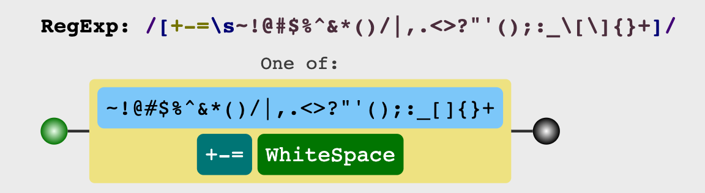

中文

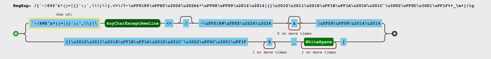

- 测试

```javascript
var reg = /[~!@#$%^&*()/\|,.<>?"'();:_+-=\[\]{}\s+]/ig;
'java -enableassertions -enablesystemassertions -classpath /usr/share/opentsdb/*.jar:/usr/share/opentsdb:/usr/share/opentsdb/bin:/usr/share/opentsdb/lib/async-1.4.0.jar:/usr/share/opentsdb/lib/asynchbase-1.7.2.jar:/usr/share/opentsdb/lib/commons-jexl-2.1.1.jar:/usr/share/opentsdb/lib/commons-logging-1.1.1.jar:/usr/share/opentsdb/lib/commons-math3-3.4.1.jar:/usr/share/opentsdb/lib/guava-18.0.jar:/usr/share/opentsdb/lib/jackson-annotations-2.4.3.jar:/usr/share/opentsdb/lib/jackson-core-2.4.3.jar:/usr/share/opentsdb/lib/jackson-databind-2.4.3.jar:/usr/share/opentsdb/lib/javacc-6.1.2.jar:/usr/share/opentsdb/lib/jgrapht-core-0.9.1.jar:/usr/share/opentsdb/lib/log4j-over-slf4j-1.7.7.jar:/usr/share/opentsdb/lib/logback-classic-1.0.13.jar:/usr/share/opentsdb/lib/logback-core-1.0.13.jar:/usr/share/opentsdb/lib/mysql-connector-java-5.1.39.jar:/usr/share/opentsdb/lib/netty-3.9.4.Final.jar:/usr/share/opentsdb/lib/protobuf-java-2.5.0.jar:/usr/share/opentsdb/lib/slf4j-api-1.7.7.jar:/usr/share/opentsdb/lib/tsdb-2.3.0.jar:/usr/share/opentsdb/lib/zookeeper-3.4.6.jar:/etc/opentsdb net.opentsdb.tools.TSDMain --port=4242 --staticroot=/usr/share/opentsdb/static --cachedir=/tmp/opentsdb --config=/etc/opentsdb/opentsdb.conf'.split(reg).join('')

```

**结果**

```javascript

"javaenableassertionsenablesystemassertionsclasspathusrshareopentsdbjarusrshareopentsdbusrshareopentsdbbinusrshareopentsdblibasyncjarusrshareopentsdblibasynchbasejarusrshareopentsdblibcommonsjexljarusrshareopentsdblibcommonsloggingjarusrshareopentsdblibcommonsmathjarusrshareopentsdblibguavajarusrshareopentsdblibjacksonannotationsjarusrshareopentsdblibjacksoncorejarusrshareopentsdblibjacksondatabindjarusrshareopentsdblibjavaccjarusrshareopentsdblibjgraphtcorejarusrshareopentsdbliblogjoverslfjjarusrshareopentsdbliblogbackclassicjarusrshareopentsdbliblogbackcorejarusrshareopentsdblibmysqlconnectorjavajarusrshareopentsdblibnettyFinaljarusrshareopentsdblibprotobufjavajarusrshareopentsdblibslfjapijarusrshareopentsdblibtsdbjarusrshareopentsdblibzookeeperjaretcopentsdbnetopentsdbtoolsTSDMainportstaticrootusrshareopentsdbstaticcachedirtmpopentsdbconfigetcopentsdbopentsdbconf"
```

## 日期验证

- 匹配规则

- 年`(/.-)`月`(/._)`日, 常见间隔符合`[/.-]`, 格式`YYYY(/.-)(M|MM)(/.-)(D|DD)`
- 闰年: **百年不闰，四百年再闰**，数学计算方式就是`Year/  400 === 0`
- `2`月特殊月份: 闰年`29`天，平年`28`天
- `1, 3, 5, 7, 8, 10, 12`: `31`天
- `4, 6, 9, 11`: `30`天

- 正则表达式

```javascript
# `MSDN`中定义的`DateTime`对象:
/^(?:(?!0000)[0-9]{4}([-/.]?)(?:(?:0?[1-9]|1[0-2])\1(?:0?[1-9]|1[0-9]|2[0-8])|(?:0?[13-9]|1[0-2])\1(?:29|30)|(?:0?[13578]|1[02])\1(?:31))|(?:[0-9]{2}(?:0[48]|[2468][048]|[13579][26])|(?:0[48]|[2468][048]|[13579][26])00)([-/.]?)0?2\2(?:29))$/

# `Unix`时间戳:
/^(?:(?:1[6-9]|[2-9][0-9])[0-9]{2}([-/.]?)(?:(?:0?[1-9]|1[0-2])\1(?:0?[1-9]|1[0-9]|2[0-8])|(?:0?[13-9]|1[0-2])\1(?:29|30)|(?:0?[13578]|1[02])\1(?:31))|(?:(?:1[6-9]|[2-9][0-9])(?:0[48]|[2468][048]|[13579][26])|(?:16|[2468][048]|[3579][26])00)([-/.]?)0?2\2(?:29))$/

# 时间`YYYY-MM-DD HH:mm:ss`:
/^(?:(?!0000)[0-9]{4}-(?:(?:0[1-9]|1[0-2])-(?:0[1-9]|1[0-9]|2[0-8])|(?:0[13-9]|1[0-2])-(?:29|30)|(?:0[13578]|1[02])-31)|(?:[0-9]{2}(?:0[48]|[2468][048]|[13579][26])|(?:0[48]|[2468][048]|[13579][26])00)-02-29)\s+([01][0-9]|2[0-3]):[0-5][0-9]:[0-5][0-9]$/
```

`MSDN`中定义的`DateTime`对象

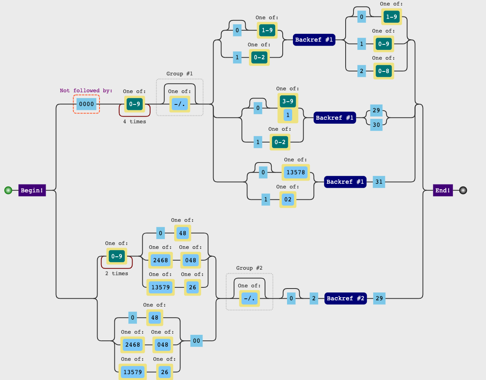

`Unix`时间戳

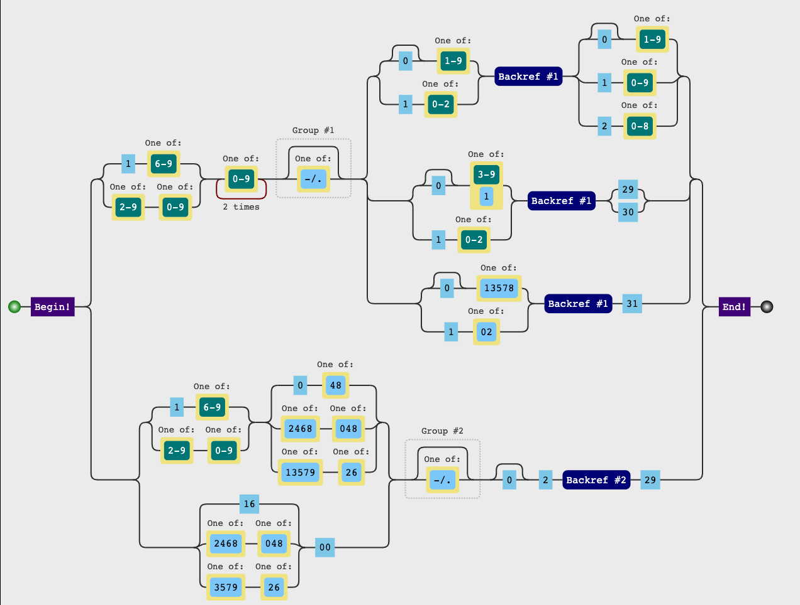

`YYYY-MM-DD HH:mm:ss`

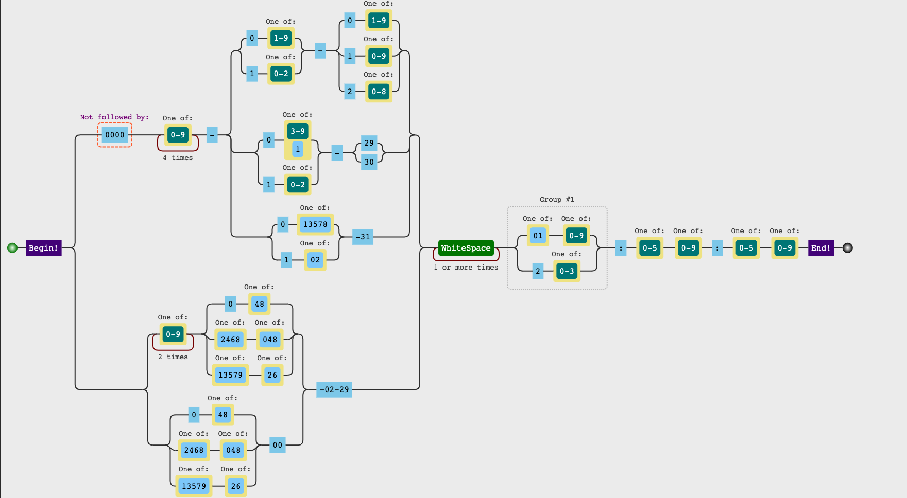

- 测试

```javascript
var reg = /^(?:(?!0000)[0-9]{4}([-/.]?)(?:(?:0?[1-9]|1[0-2])\1(?:0?[1-9]|1[0-9]|2[0-8])|(?:0?[13-9]|1[0-2])\1(?:29|30)|(?:0?[13578]|1[02])\1(?:31))|(?:[0-9]{2}(?:0[48]|[2468][048]|[13579][26])|(?:0[48]|[2468][048]|[13579][26])00)([-/.]?)0?2\2(?:29))$/
var dates = [
	'2019-01-01',
	'2019/01/01',
	'2019-1-01',
	'2019-01-1',
	'2019-02-28',
	'2019-02-29',
	'1-01-01',
	'2019-04-31',
	'2019-11-07',
];
dates.map(date => {
	console.log(date, reg.test(date));
});
```

**结果**

```javascript
2019-01-01 true
2019/01/01 true
2019-1-01 true
2019-01-1 true
2019-02-28 true
2019-02-29 false
1-01-01 false
2019-04-31 false
2019-11-07 true
```

[正则应用之——日期正则表达式](https://blog.csdn.net/lxcnn/article/details/4362500)

## 时间格式验证

- 匹配规则

24小时

12小时

- 正则表达式

```javascript
// 24h
/^((?:[01]\d|2[0-3]):[0-5]\d:[0-5]\d$)/

// 12
/^(1[0-2]|0?[1-9]):[0-5]\d:[0-5]\d$/
```

`24h`

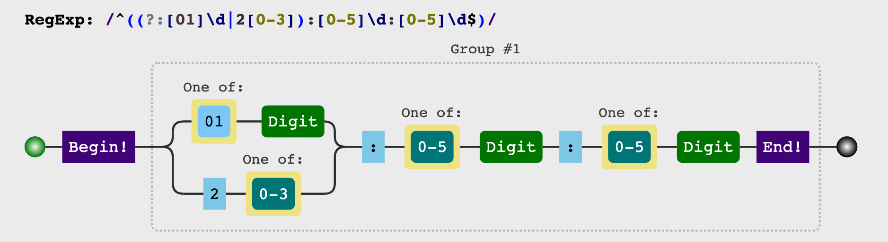

`12h`

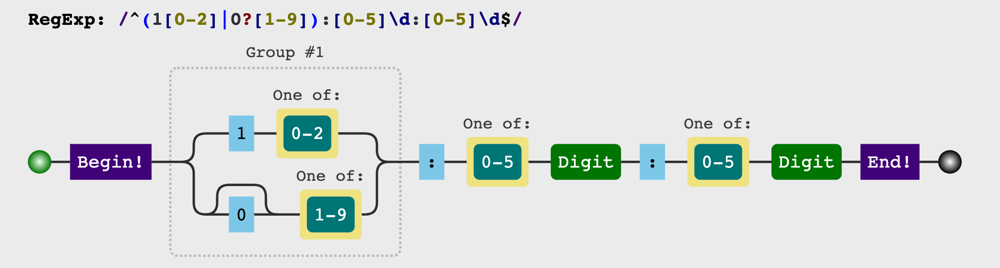

- 测试

```javascript
var reg_12 = /^(1[0-2]|0?[1-9]):[0-5]\d:[0-5]\d$/;
var reg_24 = /^((?:[01]\d|2[0-3]):[0-5]\d:[0-5]\d$)/;
var times = [
	'00:00:00',
	'0:00:0',
	'12:12:12',
	'23:59:59',
	'24:00:00',
	'11:59:59',
	'12:00:00',
	'12:12:12',
	'23:59:59',
	'24:00:00',
];
times.map(time => {
	console.log(time);
	console.group();
	console.log('reg_12', reg_12.test(time));
	console.log('reg_24', reg_24.test(time));
	console.groupEnd();
});
```

**结果**

```javascript
00:00:00
console.group
reg_12 false
reg_24 true
0:00:0
console.group
reg_12 false
reg_24 false
12:12:12
console.group
reg_12 true
reg_24 true
23:59:59
console.group
reg_12 false
reg_24 true
24:00:00
console.group
reg_12 false
reg_24 false
11:59:59
console.group
reg_12 true
reg_24 true
12:00:00
console.group
reg_12 true
reg_24 true
12:12:12
console.group
reg_12 true
reg_24 true
23:59:59
console.group
reg_12 false
reg_24 true
24:00:00
console.group
reg_12 false
reg_24 false
```


## 邮箱格式验证

- 匹配规则

- 开头：以字母、数字、下滑线`[_]`、减号`[-]`，并需要重复一次至多次。
- 中间：必须包括`@`符号。
- `@`之后到结尾，字母、数字、下滑线`[_]`、减号`[-]`，并需要重复一次至多次。
- 结尾：必须是点号`[.]`加字母。
- 不考虑中文、以及邮箱域名。

- 正则表达式

```javascript
 /^\w+([-_+.]+\w+)*@\w+([-.]\w+)*\.\w+([-.]\w+)*/
```

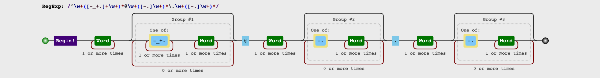

- 测试

```javascript
var reg = /^\w+([-_+.]+\w+)*@\w+([-.]\w+)*\.\w+([-.]\w+)*/;
var emails = [
	'11@qq',
	'11@qq.com',
	'Rainy@qq.com',
	'Rainy_123@qq.io',
	'Rainy_123-+asd@qq.outlook.com',
	'Rainy@qq.com.cn',
	'.11@qq.com',
	'_Rainy@qq.com',
];
emails.map(email => {
	console.log(email, reg.test(email));
});
```

**结果**

```javascript
11@qq false
11@qq.com true
Rainy@qq.com true
Rainy_123@qq.io true
Rainy_123-+asd@qq.outlook.com true
Rainy@qq.com.cn true
.11@qq.com false
_Rainy@qq.com true
```

##手机号码

- 匹配规则

物联网专用号段: 物

卫星电话专用: 卫

虚拟运营商号段: 虚

三大运营商区段:

移动:

134, 135, 136, 137, 138, 139

144(物), 147, 148

150, 151, 152, 157, 158, 159

165(虚)

1703(虚), 1705(虚), 1706(虚), 178

182, 183, 184, 187, 188

198

联通:

130, 131, 132

140(物), 145, 146

155, 156

166, 167(虚)

1704(虚), 1707(虚), 1708(虚), 1709(虚), 171(虚), 175, 176

185, 186

电信:

133, 1349

141(物), 149

153

1700(虚), 1701(虚), 1702(虚),173,  1740(卫), 177

180, 181, 189

191, 199

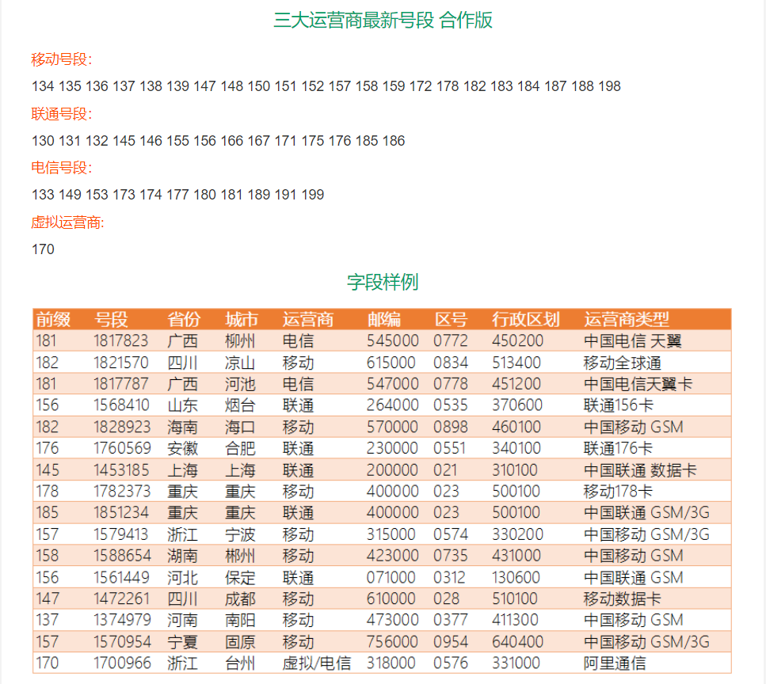

- 正则表达式

```javascript
//严格模式下
/^1((3[\d])|(4[5,6,7,9])|(5[0-3,5-9])|(6[5-7])|(7[0-8])|(8[\d])|(9[1,8,9]))\d{8}$/
// 宽松模式下
/^1([3-9])\d{9}$/
```

严格模式

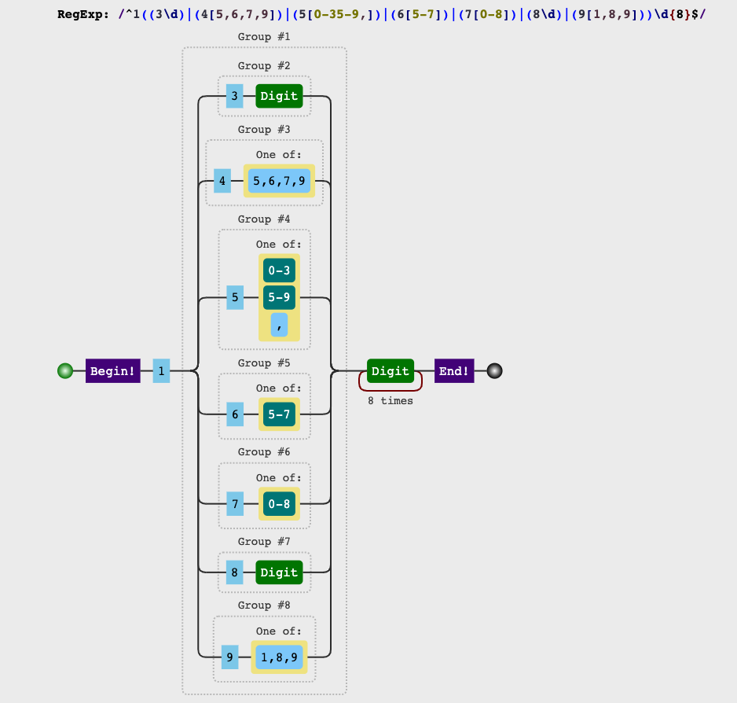

宽松模式

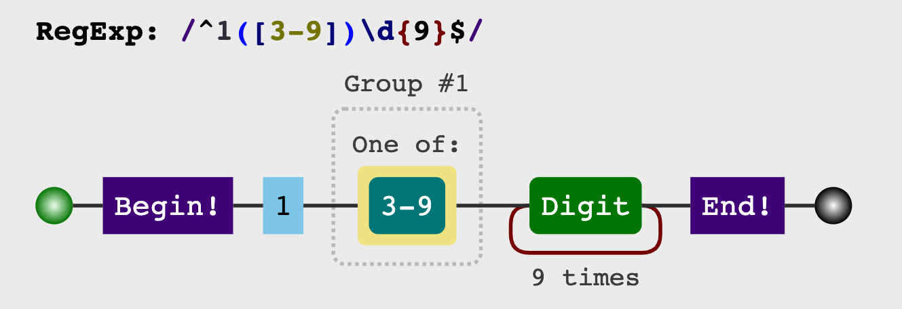

- 测试

```javascript
var reg_loose = /^1([3-9])\d{9}$/;
var reg_strict = /^1((3[\d])|(4[5,6,7,9])|(5[0-3,5-9])|(6[5-7])|(7[0-8])|(8[\d])|(9[1,8,9]))\d{8}$/;
var phonenumbers = [
	'10123456775',
	'11123456775',
	'12345678910',
	'13123456775',
	'14123456775',
	'15123456775',
	'16123456775',
	'17345678910',
	'18123456775',
	'19123456775',
];
phonenumbers.map(phonenumber => {
	console.log(phonenumber)
	console.group();
	console.log('reg_loose', reg_loose.test(phonenumber));
	console.log('reg_strict', reg_strict.test(phonenumber));
	console.groupEnd();
});
```

**结果**

```javascript
10123456775
console.group
reg_loose false
reg_strict false
11123456775
console.group
reg_loose false
reg_strict false
12345678910
console.group
reg_loose false
reg_strict false
13123456775
console.group
reg_loose true
reg_strict true
14123456775
console.group
reg_loose true
reg_strict false
15123456775
console.group
reg_loose true
reg_strict true
16123456775
console.group
reg_loose true
reg_strict false
17345678910
console.group
reg_loose true
reg_strict true
18123456775
console.group
reg_loose true
reg_strict true
19123456775
console.group
reg_loose true
reg_strict true
```

## 身份证号

- 匹配规则

1. 一代 15位: 6位地区码，6位生日，3位顺序码

2. 二代18位，最后一位可能为数字或者`X`: 6位地区码，8位生日，3位顺序码, 1位校验码

3. 同时匹配

- 正则表达式

```javascript
// 15
/^\d{8}(0\d|11|12)(0[1-9]|[1-2]\d|30|31)\d{3}$/

// 18
/^\d{6}(18|19|20)\d{2}(0\d|11|12)(0[1-9]|[1-2]\d|30|31)\d{3}(\d|X|x)$/
                                                      
// 15 | 18
/(^\d{8}(0\d|11|12)(0[1-9]|[1-2]\d|30|31)\d{3}$)|(^\d{6}(18|19|20)\d{2}(0\d|11|12)(0[1-9]|[1-2]\d|30|31)\d{3}(\d|X|x)$)/
```

15位

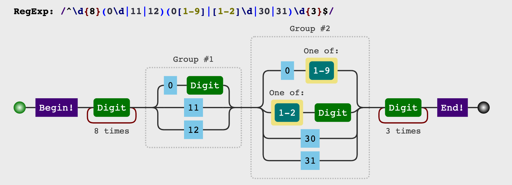

18位

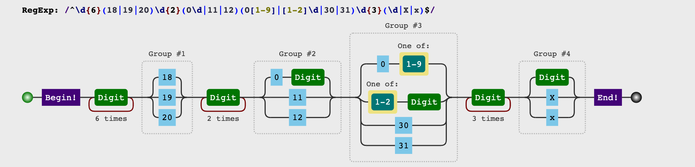

15 & 18位

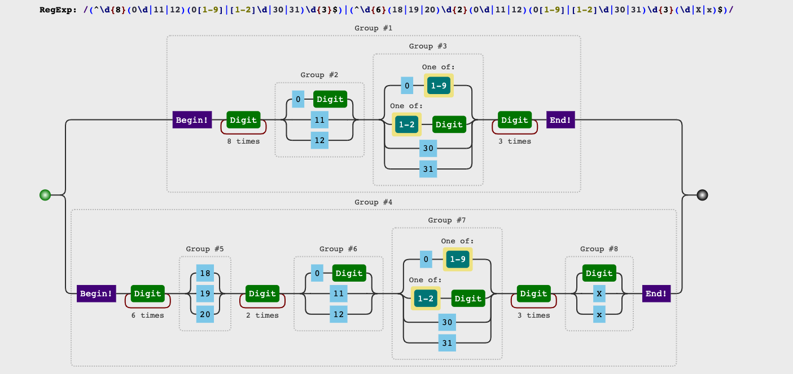

- 测试

```javascript
var reg_15 = /^\d{8}(0\d|11|12)(0[1-9]|[1-2]\d|30|31)\d{3}$/
var reg_18 = /^\d{6}(18|19|20)\d{2}(0\d|11|12)(0[1-9]|[1-2]\d|30|31)\d{3}(\d|X|x)$/
var reg_15_18 = /(^\d{8}(0\d|11|12)(0[1-9]|[1-2]\d|30|31)\d{3}$)|(^\d{6}(18|19|20)\d{2}(0\d|11|12)(0[1-9]|[1-2]\d|30|31)\d{3}(\d|X|x)$)/
var id_numbers = [
	'345678001100234',
	'345678991100234',
	'345678001101234',
	'345678991101234',
	'345678991101234',
	'345678199911002345',
	'345678119911002345',
	'345678199911012345',
	'34567819991101234x',
	'34567819991101234X',
];
id_numbers.map(id_number => {
	console.log(id_number)
	console.group();
	console.log('reg_15', reg_15.test(id_number));
	console.log('reg_18', reg_18.test(id_number));
	console.log('reg_15_18', reg_15_18.test(id_number));
	console.groupEnd();
});
```

**结果**

```javascript
345678001100234
console.group
reg_15 false
reg_18 false
reg_15_18 false
345678991100234
console.group
reg_15 false
reg_18 false
reg_15_18 false
345678001101234
console.group
reg_15 true
reg_18 false
reg_15_18 true
345678991101234
console.group
reg_15 true
reg_18 false
reg_15_18 true
345678991101234
console.group
reg_15 true
reg_18 false
reg_15_18 true
345678199911002345
console.group
reg_15 false
reg_18 false
reg_15_18 false
345678119911002345
console.group
reg_15 false
reg_18 false
reg_15_18 false
345678199911012345
console.group
reg_15 false
reg_18 true
reg_15_18 true
34567819991101234x
console.group
reg_15 false
reg_18 true
reg_15_18 true
34567819991101234X
console.group
reg_15 false
reg_18 true
reg_15_18 true
```

## 千分位

- 匹配规则

- 正则表达式

```javascript
 /(\d{1,3})(?=(\d{3})+(?:$|\.))/g
```

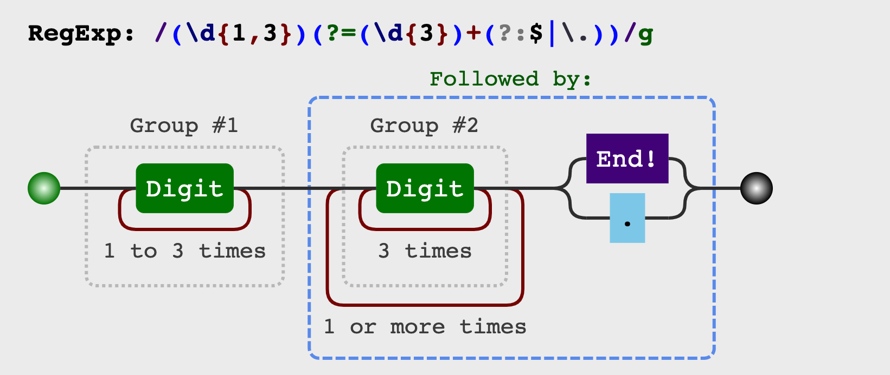

- 测试

```javascript
var reg = /(\d{1,3})(?=(\d{3})+(?:$|\.))/g;
var numbers = [
	123,
	123456,
	1234123256,
	1234123256.23,
	123412345434.543,
	1233456345643.45434,
	1234123454345434.5562,
	123345634564345434.1232,
	'1234qweqw56',
	'1234qwe56',
	'1234wqeqw56',
];
numbers.map(number => {
	var val = (number + '').replace(reg, '$1,');
	console.log(number, reg.test(number), val);
});
```

**结果**

```javascript
123 false "123"
123456 true "123,456"
1234123256 true "1,234,123,256"
1234123256.23 true "1,234,123,256.23"
123412345434.543 true "123,412,345,434.543"
1233456345643.4543 true "1,233,456,345,643.4,543"
1234123454345434.5 true "1,234,123,454,345,434.5"
123345634564345440 true "123,345,634,564,345,440"
1234qweqw56 false 1234qweqw56
1234qwe56 false 1234qwe56
1234wqeqw56 false 1234wqeqw56
```

## 判断HEX 16进制颜色

- 匹配规则

1. 16进制
2. 两两相等可以缩写
3. A-F` + `0-9`
4. 三位或者六位
5. 不区分大小写

- 正则表达式

```javascript
// 1
/^#?([a-fA-F0-9]{6}|[a-fA-F0-9]{3})$/

// 2
/(^#[\dA-F]{6}$)|(^#[\dA-F]{3}$)/i
```

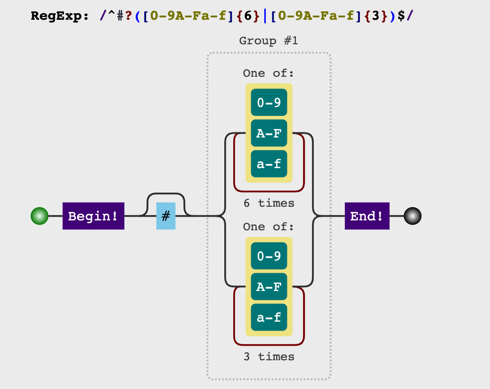

- 测试

```javascript
// 1
var reg = /^#?([a-fA-F0-9]{6}|[a-fA-F0-9]{3})$/;
var colors = [
	'123',
	'123456',
	'#ff00ff',
	'#f0f',
	'#FF00FF',
	'#F0F',
	'#123456',
	'#FFFFFG',
];
colors.map(color => {
	console.log(color, reg.test(color));
});

// 2
var reg = /(^#[\dA-F]{6}$)|(^#[\dA-F]{3}$)/i;
var colors = [
    'FFF',
  	'#fsa',
    '#FFF',
    '#fff',
    '#FFF000',
    '#fff123',
    '#adf123',
];
colors.map(color => {
	console.log(color, reg.test(color));
});
```

**结果**

```javascript
// 1
123 true
123456 true
#ff00ff true
#f0f true
#FF00FF true
#F0F true
#123456 true
#FFFFFG false
// 2
FFF false
#fsa false
#FFF true
#fff true
#FFF000 true
#fff123 true
#adf123 true
```

## 判断RGB, RGBA颜色

- 匹配规则

- `rgb(`或者`rgba`开头, 不区分大小写
- `r`, `g`, `b` 值范围 `[0-255]`, 每一个值后面的`,`前后可接`0-n`个空格
- `a` 值范围 `[0-1]`, `a < 1`时可省略 `0`

- 正则表达式

```javascript
// 1
// rgb
/^rgb\(((\d{1,2}|1\d{2}|2([0-4]\d|5[0-5]))\s*,\s*){2}((\d{1,2}|1\d\d|2([0-4]\d|5[0-5]))\s*)\)$/i
// rgba
/^rgba\(((\d{1,2}|1\d{2}|2([0-4]\d|5[0-5]))\s*,\s*){2}((\d{1,2}|1\d\d|2([0-4]\d|5[0-5]))\s*)(,\s*(0?\.\d+|1|0)+)+\)$/i

// Group
// rgb
/^rgb\(((\d{1,2}|1\d{2}|2([0-4]\d|5[0-5]))(\s*,\s*)){2}\2\)$/i
// rgba
/^rgba\(((\d{1,2}|1\d{2}|2([0-4]\d|5[0-5]))(\s*,\s*)){2}\2\4+(0?\.\d+|1|0)+\)$/i
```

**RGB**

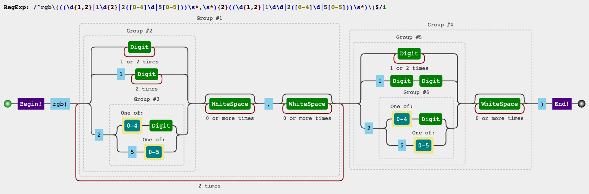

**Group**

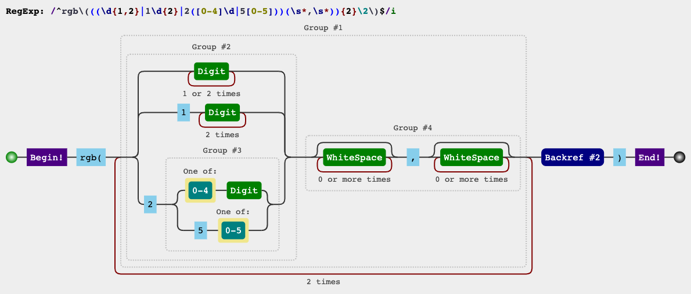

**RGBA**

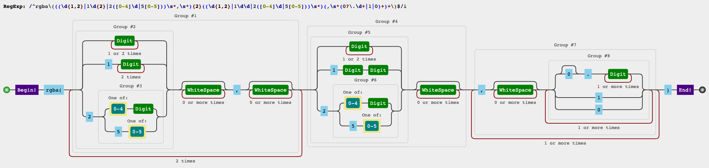

**Group**

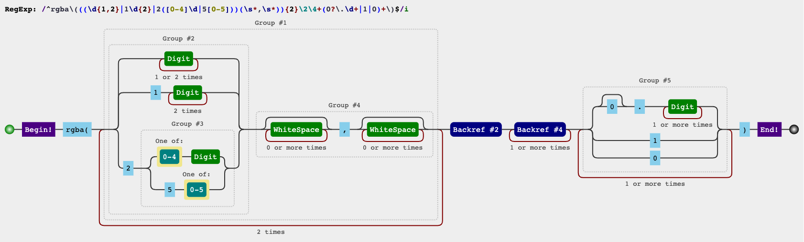

- 测试

```javascript
var reg = /^rgba\(((\d{1,2}|1\d{2}|2([0-4]\d|5[0-5]))\s*,\s*){2}((\d{1,2}|1\d\d|2([0-4]\d|5[0-5]))\s*)(,\s*(0?\.\d+|1|0)+)+\)$/i;
var colors = [
    'rgba(0, 0, 0, 1)',
    'rgba(255, 0, 0, 1)',
    'rgba(0, 255, 0, 1)',
    'rgba(0, 0, 255, 1)',
    'rgba(256, 0, 0, 1)',
    'rgba(0, 256, 0, 1)',
    'rgba(0, 0, 256, 1)',
    'rgba(255, 255, 255, 0)',
    'rgba(0, 255, 0, 0.2)',
    'rgba(0, 255, 0, .2)',
    'rgba(255, 255, 255)',
    'rgba(255, 255, 255, )',
    'RGBA(0, 0, 255, 1)',
    'RGBA(0, 255, 0, 0.2)',
    'RGBA(0, 255, 0, .2)',
    'RGBA(0, 255, 0, )',
];
colors.map(color => {
	console.log(color, reg.test(color));
});
```

**结果**

```javascript
rgba(0, 0, 0, 1) true
rgba(255, 0, 0, 1) true
rgba(0, 255, 0, 1) true
rgba(0, 0, 255, 1) true
rgba(256, 0, 0, 1) false
rgba(0, 256, 0, 1) false
rgba(0, 0, 256, 1) false
rgba(255, 255, 255, 0) true
rgba(0, 255, 0, 0.2) true
rgba(0, 255, 0, .2) true
rgba(255, 255, 255) false
rgba(255, 255, 255, ) false
RGBA(0, 0, 255, 1) true
RGBA(0, 255, 0, 0.2) true
RGBA(0, 255, 0, .2) true
RGBA(0, 255, 0, ) false
```

[JS HEX十六进制与RGB, HSL颜色的相互转换](https://www.zhangxinxu.com/wordpress/2010/03/javascript-hex-rgb-hsl-color-convert/)

## 判断HSL, HSLA颜色

- 匹配规则

- `Hue(色调)` 取值范围`[0-360]`

- `Saturation(饱和度)` 取值范围`[0%-100%]`

- `Lightness (亮度)`  取值范围`[0%-100%]`

- `alpha (透明度)` 取值范围`[0-1]`

- 正则表达式

```javascript
// HSL
/^hsl\(\s*((\d{1,2}|[1-2]\d{2}|3([0-5]\d|60)))\s*,(\s*(((\d{1,2}|100)%)|0)\s*,)(\s*(((\d{1,2}|100)%)|0)\s*)\)$/i

// HSLA
/^hsla\(\s*((\d{1,2}|[1-2]\d{2}|3([0-5]\d|60)))\s*,(\s*(((\d{1,2}|100)%)|0)\s*,){2}\s*(0?\.\d+|1|0)\)$/i
```

**HSL**

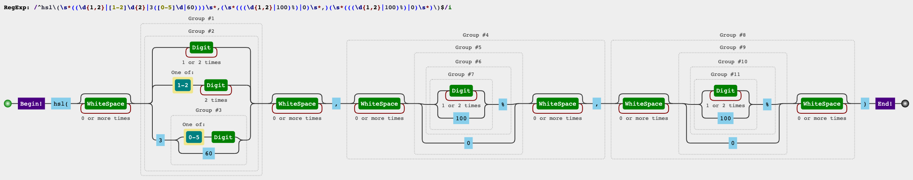

**HSLA**

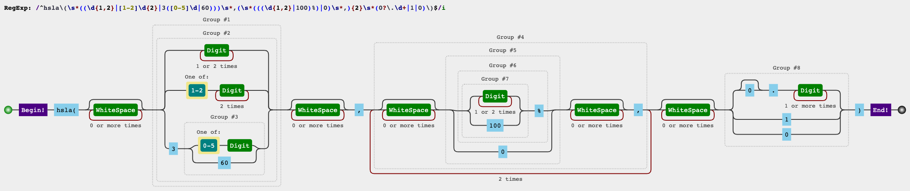

- 测试

```javascript
var reg = /^hsla\(\s*((\d{1,2}|[1-2]\d{2}|3([0-5]\d|60)))\s*,(\s*(((\d{1,2}|100)%)|0)\s*,){2}\s*(0?\.\d+|1|0)\)$/i;
var colors = [
    'hsla(0, 0, 0, 1)',
    'hsla(360, 0, 0, 1)',
    'hsla(0, 100%, 0, 1)',
    'hsla(0, 0, 100%, 1)',
    'hsla(361, 0, 0, 1)',
    'hsla(0, 101%, 0, 1)',
    'hsla(0, 0, 101%, 1)',
    'hsla(360, 100%, 100%, 1)',
    'hsla(0, 100%, 0, 0.2)',
    'hsla(0, 100%, 0, .2)',
    'hsla(360, 100%, 100%)',
    'hsla(255, 100%, 100%, )',
    'HSLA(0, 0, 100%, 1)',
    'HSLA(0, 100%, 0, 0.2)',
    'HSLA(0, 100%, 0, .2)',
    'HSLA(0, 100%, 0, )',
];
colors.map(color => {
	console.log(color, reg.test(color));
});
```

**结果**

```javascript
hsla(0, 0, 0, 1) true
hsla(360, 0, 0, 1) true
hsla(0, 100%, 0, 1) true
hsla(0, 0, 100%, 1) true
hsla(361, 0, 0, 1) false
hsla(0, 101%, 0, 1) false
hsla(0, 0, 101%, 1) false
hsla(360, 100%, 100%, 1) true
hsla(0, 100%, 0, 0.2) true
hsla(0, 100%, 0, .2) true
hsla(360, 100%, 100%) false
hsla(255, 100%, 100%, ) false
HSLA(0, 0, 100%, 1) true
HSLA(0, 100%, 0, 0.2) true
HSLA(0, 100%, 0, .2) true
HSLA(0, 100%, 0, ) false
```

## 模板

- 匹配规则

- 正则表达式

```javascript

```

- 测试

```javascript

```

**结果**

```javascript

```


##
[正则表达式可视化 1](https://jex.im/regulex)

[正则表达式可视化 2](https://regex101.com/)

