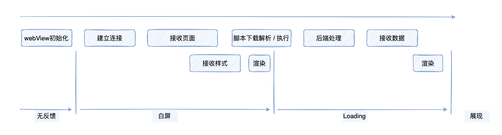

# 前端应用加载通常需要经历的过程

## 优化方案

根据前端应用加载流程，常用的优化方案如下

- webView 初始化
    - App 首次打开时，默认由 App 初始化一个浏览器内核

- 重链接
    - 自检 nginx 上 rewrite 次数是否过多，检查页面有无301、302的状况，避免无意义的重定向

- DNS，项目资源基于公司的 CDN
  - CDN 预热
      - 把资源从源站推送到 CDN 节点，避免 CDN 回源
  - 资源域名与客户端保持一致
  - DNS prefetch
      - 在 html 中添加 dns-prefetch 相关代码，解决 DNS 解析延迟
  - gzip & http2
      - 对文件大小进行压缩，同时采用二进制格式传输数据
  - 合理利用浏览器缓存

- 代码层面
  - tree shaking 优化
  - 实现路由的懒加载
  - 常用的库单独打包
  - 活用本地缓存
    - 比如处理省市区选择的时候，localStorage缓存到本地
  - 接口相应速度的提升
  - 避免 DOM 层级过深
  - 尽量少的重排重绘

- 升级到 WKwebview 内核