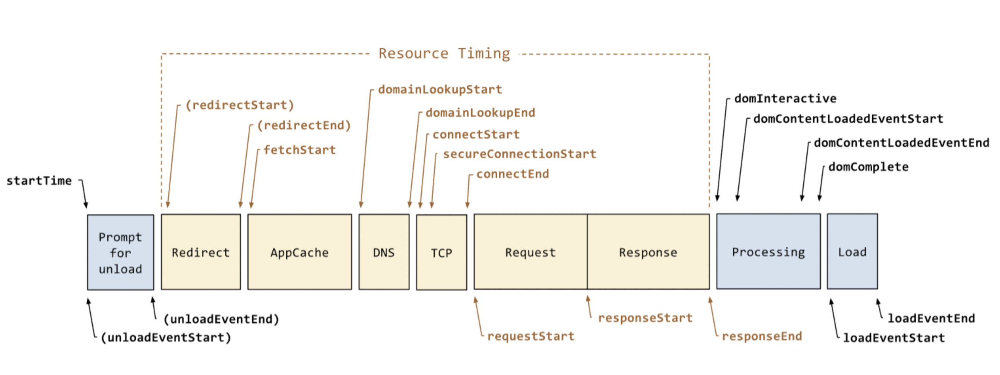

# 性能指标

性能统计SDK的数据来自于浏览器提供的performance，performance中各个中间过程如上图，目前基于以上计算出来的指标有如下：

| 指标名称     | 代码解释                            | 文字解释                                                     | 是否具备参考意义                                             |
| ------------ | ----------------------------------- | ------------------------------------------------------------ | ------------------------------------------------------------ |
| tNavigation  | domainLookupStart - navigationStart | AppCache之前的耗时                                           | 是                                                           |
| tDNS         | domainLookupEnd - domainLookupStart | DNS区域耗时                                                  | 是，DNS查询时间，受网络影响大，应该为关键指标                |
| tTcp         | connectEnd - connectStart           | TCP区域耗时                                                  | 是，TCP连接时间，受网络影响大，应该为关键指标                |
| tRequest     | responseStart - requestStart        | Reqeust区域耗时（TTFB）                                      | 是，TTFB时间（首字节等待时间），受网络影响大，应该为关键指标 |
| tResponse    | responseEnd - responseStart         | Response区域耗时（Content Download时间）                     | 是，资源下载时间，受网络影响大，应为关键指标                 |
| tDomComplete | domComplete - domLoading            | Processing区域耗时与Response中部分耗时之和，因为domLoading可能发生在Response区域中 | 是，dom渲染时间，受前端页面的代码量、代码书写方式影响大，是衡量页面性能需要关注的一个指标，应该为关键指标 |
| tLoad        | loadEventEnd - loadEventStart       | Load区域（onload触发时间，如果onload函数中有同步耗时操作，会影响这部分耗时，一般很短） | 否，时间一般很短，不具备参考意义                             |
| tDomTotal    | domComplete - navigationStart       | 页面开始到dom渲染完成耗时                                    | 否，与前面的指标有重合，不具备参考意义                       |
| tWhiteScreen | responseStart - navigationStart     | 页面开始到资源下载完成耗时                                   | 否，经过实验，资源下载完成，页面并非就有内容，这个字段判断是不准确的，所以不具备参考意义 |
| tLoadTotal   | loadEventEnd - navigationStart      | 页面总耗时                                                   | 是，这个是页面总耗时，属于关键指标                           |
| tViewTime    |                                     | 用户点击到页面onload完成时间                                 | 是，这个是用户维度的指标                                     |

### 性能检测工具

https://pagespeed.web.dev/

### polyfill CDN

https://polyfill.io/v3/url-builder/
