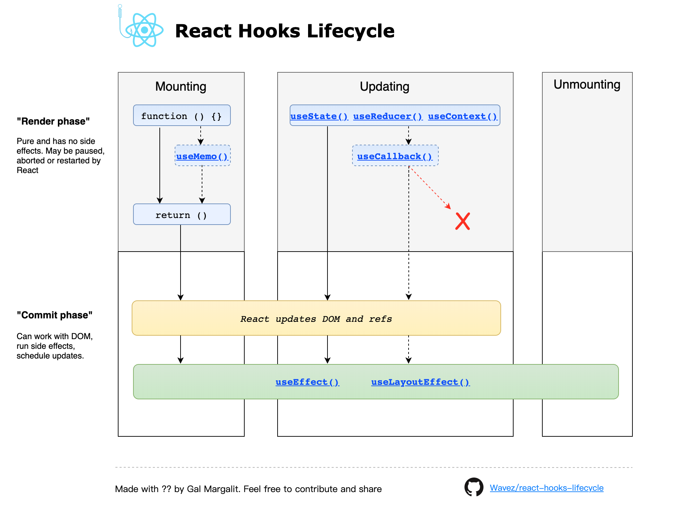
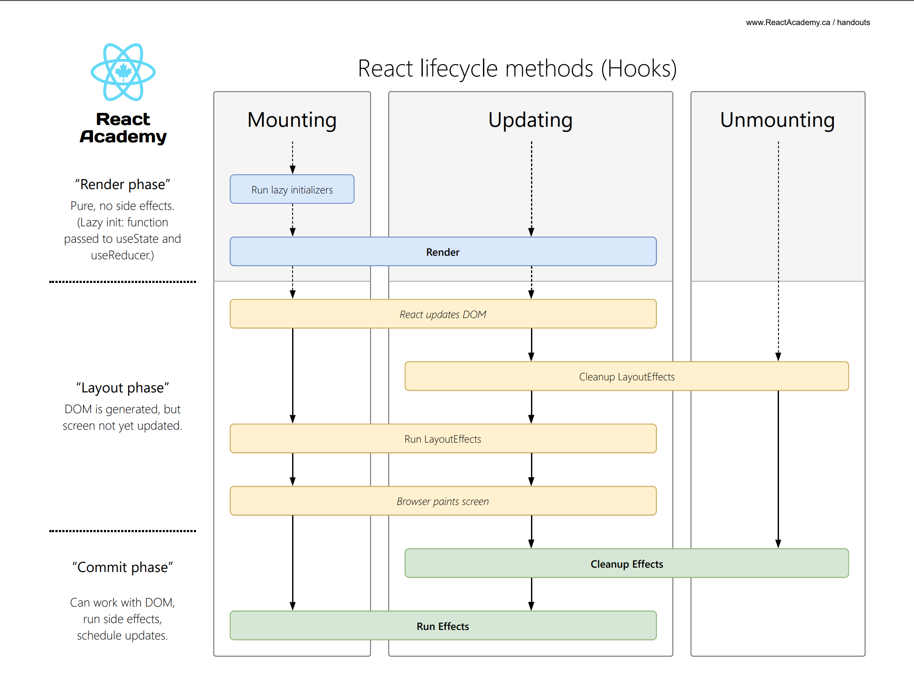
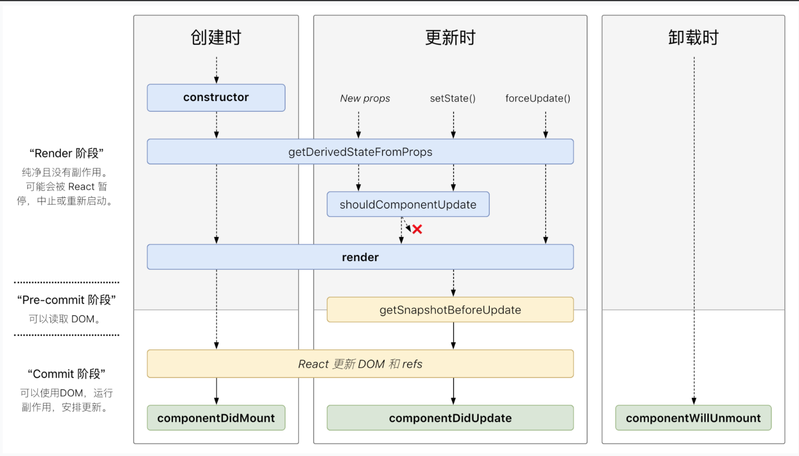
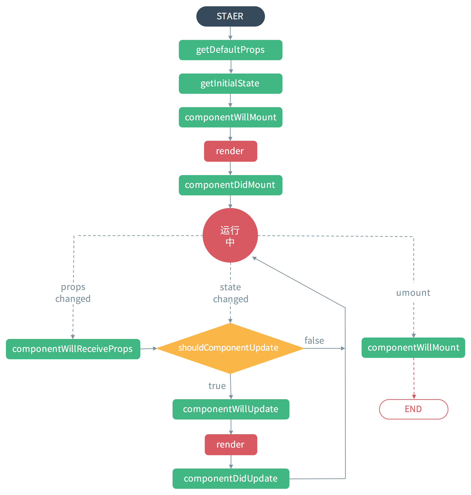

# Hooks 生命周期

| Hooks                                      | Class Componets                          |
| ------------------------------------------ | ---------------------------------------- |
| `useEffect`                                | `componentDidMount`,`componentDidUpdate` |
| `useEffect` 第一个参数`return`的`callback` | `componentWillUnmount`                   |
| 函数没有                                   | `constructor`                            |
| 函数组件体本身                             | `render`                                 |
| `React.memo`                               | `shouldComponentUpdate`                  |
| `useState` `update`函数                    | `getDerivedStateFromProps`               |

`React 16.3+` 生命周期

详见[生命周期方法要如何对应到 Hook？](https://zh-hans.reactjs.org/docs/hooks-faq.html#how-do-lifecycle-methods-correspond-to-hooks)