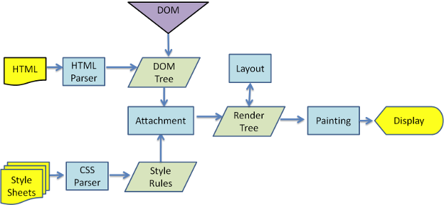

参数列表与 [useEffect()](./useEffect.md) 一样

**区别:**

- `useEffect`是异步的 `(不会阻塞浏览器渲染)`, `useLayoutEffect`是同步的 `(会阻塞浏览器渲染)`
- `useLayoutEffect` 会在 浏览器` layout` 之后，`painting(渲染)` 之前执行, `useEffect` 在全部渲染完毕后才会执行

[你可能不是“我”所认识的useEffect](https://imweb.io/topic/5cd845cadcd62f86299fcd76)
