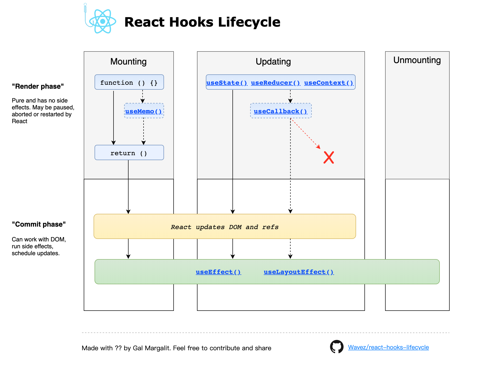
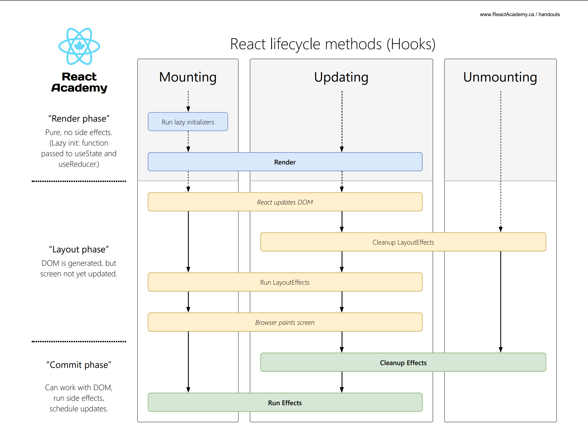
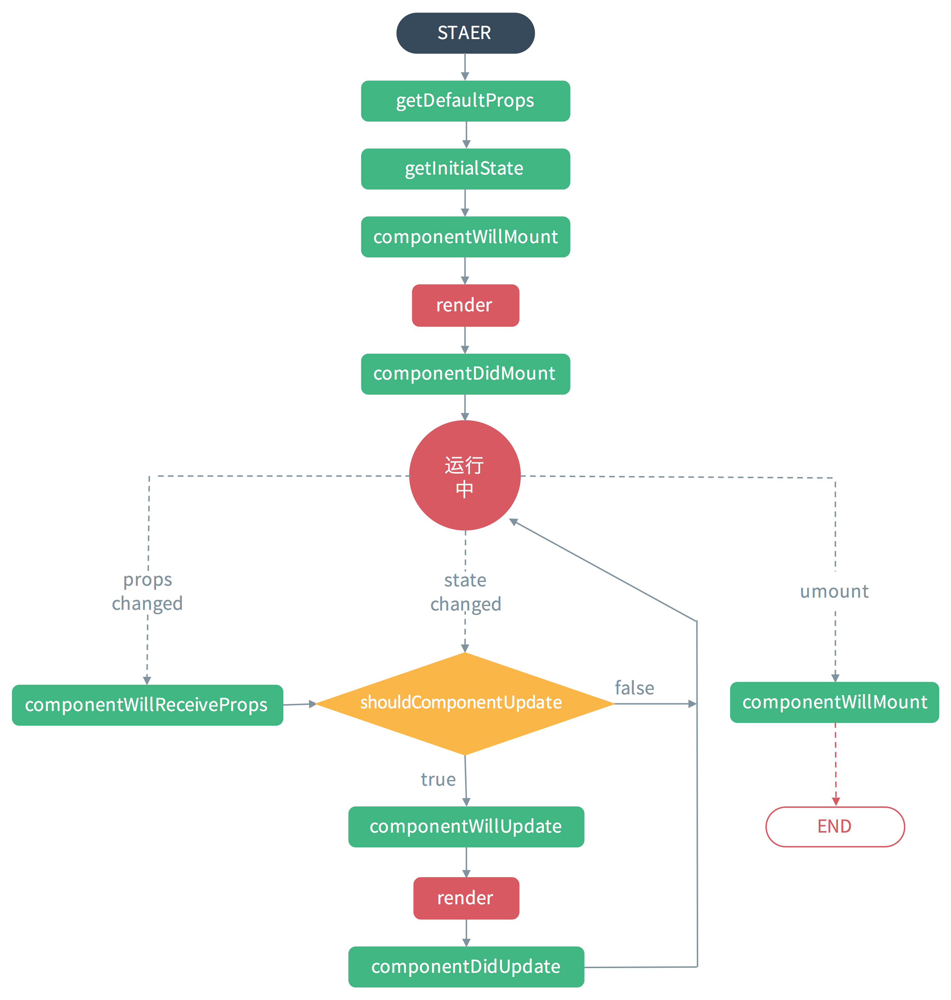

# React 生命周期

## Hooks 生命周期

<iframe
    src="https://wavez.github.io/react-hooks-lifecycle/"
    width="100%"
    height="800"
></iframe>

<!--  -->

<iframe
    src="https://lifecycle.reactacademy.live/"
    width="100%"
    height="900"
></iframe>

<!--  -->

| Hooks                                      | Class Componets                          |
| ------------------------------------------ | ---------------------------------------- |
| `useEffect`                                | `componentDidMount`,`componentDidUpdate` |
| `useEffect` 第一个参数`return`的`callback` | `componentWillUnmount`                   |
| 函数没有                                   | `constructor`                            |
| 函数组件体本身                             | `render`                                 |
| `React.memo`                               | `shouldComponentUpdate`                  |
| `useState` `update`函数                    | `getDerivedStateFromProps`               |

## Class 生命周期

<iframe
    src="https://projects.wojtekmaj.pl/react-lifecycle-methods-diagram/"
    width="100%"
    height="900"
></iframe>

`< React 16.3`

详见[生命周期方法要如何对应到 Hook？](https://zh-hans.reactjs.org/docs/hooks-faq.html#how-do-lifecycle-methods-correspond-to-hooks)

## 参考

[reactacademy handouts](https://www.reactacademy.live/handouts/)