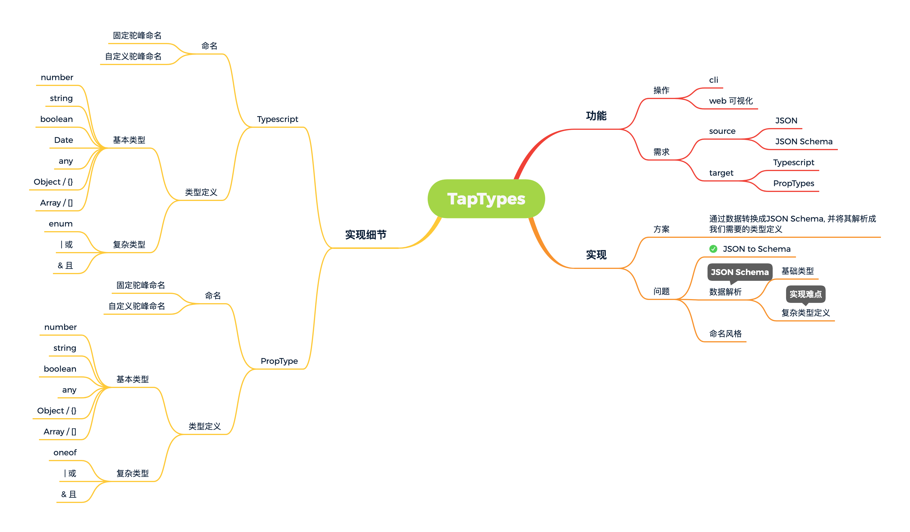

# Tap Types(废弃)

## 前言

### 为什么会有这个想法？

- 后端接口使用`fastjson`过滤导致前端很多莫名的兼容和`bug`
  - 有没有办法快速定义接口的数据结构
- 大量的`JSON`数据快速完成类型定义

## 基础构思 + 设计

## 实现难点

✅ `JSON Schema` 转换 

❎ 数据解析

- 简单类型定义
- 复杂类型定义

❎ 操作

- `cli`
- `web` 可视化

## 体验

先注册包，暂时不可以使用

~~[tap-types](https://www.npmjs.com/package/tap-types)~~

## 参考资料

[to-json-schema](https://github.com/imcuttle/to-json-schema/blob/master/index.js)

[quicktype](https://github.com/quicktype/quicktype)

[transform](https://github.com/ritz078/transform)

