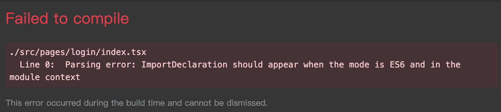

# Typescript Eslint QA
## 项目配置完 eslint之后报👇错误

`Parsing error: ImportDeclaration should appear when the mode is ES6 and in the module context`



解决办法:

```json
// .eslintrc
{
  "parser": "@typescript-eslint/parser",
  "parserOptions": {
    // //也就是ES6语法支持的意思
    "ecmaVersion": 6,
    "sourceType": "module",
    "ecmaFeatures": {
        "modules": true
    }
  },
  "plugins": ["@typescript-eslint"],
  // ...
}

```

## 参考

[eslint issue 55](https://github.com/eslint/eslint-scope/issues/55)

[eslint issue 56](https://github.com/eslint/eslint-scope/issues/56)

[eslint issue 4344](https://github.com/eslint/eslint/issues/4344)

[eslint specifying-parser-options](https://eslint.org/docs/user-guide/configuring#specifying-parser-options)

