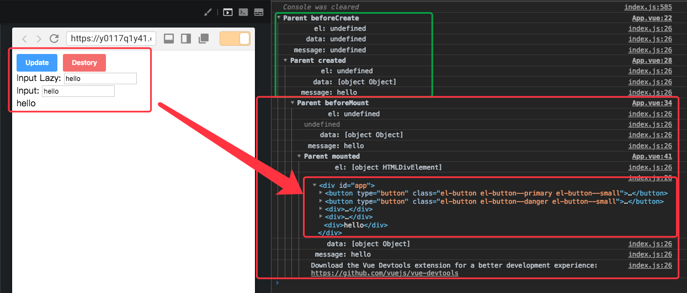
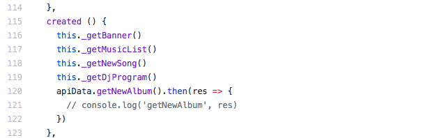
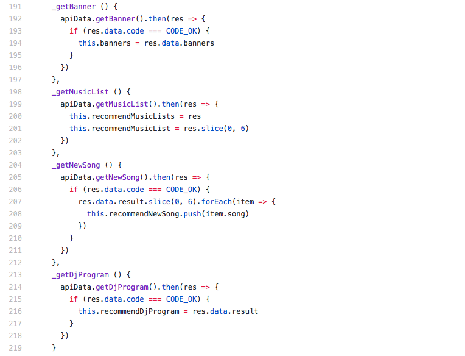
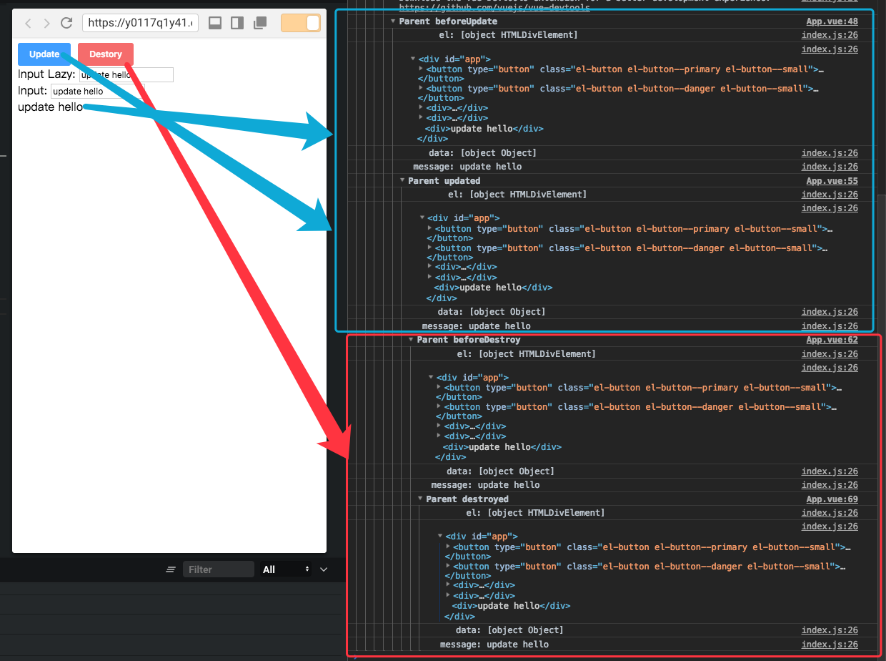

# Vue2


[详见Vue 生命周期](https://vue.docschina.org/v2/guide/instance.html#%E7%94%9F%E5%91%BD%E5%91%A8%E6%9C%9F%E7%A4%BA%E6%84%8F%E5%9B%BE)

[选项 / 生命周期钩子](https://vue.docschina.org/v2/api/#%E9%80%89%E9%A1%B9-%E7%94%9F%E5%91%BD%E5%91%A8%E6%9C%9F%E9%92%A9%E5%AD%90)

我们通过`Vue`提供的生命周期钩子对`Vue`的整个生命周期来加深我们对它的理解。

[测试代码地址](https://codesandbox.io/s/y0117q1y41)

**App.vue**

```js
<template>
  <div id="app">
    <el-button type="primary" size="small" @click="update">Update</el-button>
    <el-button type="danger" size="small" @click="destory">Destory</el-button>
    <div>Input Lazy: <input v-model.lazy="message" /></div>
    <div>Input: <input v-model="message" /></div>
    <div>{{ message }}</div>
  </div>
</template>

<script>
import ChildLifeCycle from "./components/ChildLifeCycle.vue";

export default {
  name: "App",
  data() {
    return {
      message: "hello"
    };
  },
  beforeCreate() {
    console.group("beforeCreate");
    console.log(`      el: ${this.$el}`);
    console.log(`    data: ${this.$data}`);
    console.log(` message: ${this.message}`);
  },
  created() {
    console.group("created");
    console.log(`      el: ${this.$el}`);
    console.log(`    data: ${this.$data}`);
    console.log(` message: ${this.message}`);
  },
  beforeMount() {
    console.group("beforeMount");
    console.log(`      el: ${this.$el}`);
    console.log(this.$el);
    console.log(`    data: ${this.$data}`);
    console.log(` message: ${this.message}`);
  },
  mounted() {
    console.group("mounted");
    console.log(`      el: ${this.$el}`);
    console.log(this.$el);
    console.log(`    data: ${this.$data}`);
    console.log(` message: ${this.message}`);
  },
  beforeUpdate() {
    console.group("beforeUpdate");
    console.log(`      el: ${this.$el}`);
    console.log(this.$el);
    console.log(`    data: ${this.$data}`);
    console.log(` message: ${this.message}`);
  },
  updated() {
    console.group("updated");
    console.log(`      el: ${this.$el}`);
    console.log(this.$el);
    console.log(`    data: ${this.$data}`);
    console.log(` message: ${this.message}`);
  },
  beforeDestroy() {
    console.group("beforeDestroy");
    console.log(`      el: ${this.$el}`);
    console.log(this.$el);
    console.log(`    data: ${this.$data}`);
    console.log(` message: ${this.message}`);
  },
  destroyed() {
    console.group("destroyed");
    console.log(`      el: ${this.$el}`);
    console.log(this.$el);
    console.log(`    data: ${this.$data}`);
    console.log(` message: ${this.message}`);
  },
  methods: {
    update() {
      this.message = "update hello";
    },
    destory() {
      this.$destroy();
    }
  },
  components: {
    ChildLifeCycle
  }
};
</script>

<style></style>

```

## create + mounted



从上面的执行结果我们可以知道，`beforeCreate`和`created`,在这两个`hook`之间，`Vue`实例会进行事件初始化, 配置`Event`和`watch`,对`data`, `props`,`computed`进行数据观测(`data observer`)。此时，`$el`还不存在，但在`create`时`data`属性已经存在，所以，如果我们的数据不依赖`dom`，我们可以在这个`hook`中进行`API`数据获取。

从生命周期图和`console`上我们看出，在`create`时`this.$el`还是`undefined`，所以此处会等待`Vue`实例调用`vm.mounted($el)`，接着判断是否有`template`配置，有就使用`template`作为`render`函数，没有就通过编辑`outHTML`作为`template`，`render`函数选项 > `template`选项 > `outer HTML`。此时`mounted`中`el`,`data`都已经初始化了，当我们的数据对`DOM`有相对应的依赖时，我们可以在这个`hook`下进行数据请求。

`create`钩子数据请求`demo`:





## update + destory



`beforeDestroy`钩子函数在实例销毁之前调用。在这一步，实例仍然完全可用, this仍能获取到实例。
`destroyed`钩子函数在`Vue `实例销毁后调用。调用后，`Vue `实例指示的所有东西都会解绑定，所有的事件监听器会被移除，所有的子实例也会被销毁。组件上几乎没有任何东西。 与之相关的一切都被销毁了。 


| 生命周期钩子    | 详细说明                                                     | 使用场景                                                     |
| --------------- | ------------------------------------------------------------ | ------------------------------------------------------------ |
| `beforeCreate`  | `Vue`: 在实例初始化之后，立即同步调用，在数据观察(`data observer`)和 `event/watcher` 配置之前被调用。<br />在组件的初始化时运行。 `data`尚未被反应，`event`尚未建立。 | 常用于初始化非响应式变量                                     |
| `created`       | `Vue`: 实例已经创建完成之后被调用。在这一步，实例已完成以下的配置：数据观测(`data observer`)，属性和方法的运算， `watch/event `事件回调。然而，挂载阶段还没开始，`$el` 属性目前不可见。<br />在这个钩子中能够访问被动数据并且`event`处于活动状态。 模板和虚拟`DOM`尚未`mounted`或`render`。 | 简单的`ajax`请求，页面的初始化                               |
| `beforeMount`   | `Vue`: 在挂载开始之前被调用：相关的 `render` 函数首次被调用。<br />`beforeMount hook`:在初始渲染发生之前以及编译模板或渲染函数之后运行。 | 很可能你永远不需要使用这个钩子。                             |
| `mounted`       | `Vue` : 在实例挂载之后调用，其中 `el` 被新创建的 `vm.$el` 替代。如果 root 实例挂载了一个文档内元素，当 `mounted` 被调用时 `vm.$el` 也在文档内。<br />`mounted hook`，可以完全访问被动组件，模板和呈现的DOM（通过`this.$el`)。 `Mounted`是最常用的生命周期钩子。 | 通过`ajax`获取组件的数据（为此创建的用途）和修改`DOM`，通常用于集成非`Vue`库。 |
| `beforeupdate`  | `Vue`: 在 DOM 被 patch 之前调用数据修改。这是在 DOM 更新之前，访问已有 DOM 的最佳时机，例如，手动地移除之前添加的事件监听器。<br />`beforeUpdate hook`在组件上的数据更改和更新周期开始之后运行，就在`patched`和`re-render DOM`之前。 它允许您在组件实际呈现之前获取组件上任何被动数据的新状态。 |                                                              |
| `updated`       | `Vue`: 由于数据更改导致的虚拟 DOM 重新渲染和打补丁，在这之后会调用该钩子。当这个钩子被调用时，组件 DOM 已经更新，所以你现在可以执行依赖于 DOM 的操作。然而在大多数情况下，你应该避免在此期间更改状态。如果要相应状态改变，通常最好使用[计算属性](https://vue.docschina.org/v2/api/#computed)或 [watcher](https://vue.docschina.org/v2/api/#watch) 取而代之。 | 如果您需要在更改属性后访问`DOM`，这可能是最安全的地方。      |
| `beforeDestroy` | 实例销毁之前调用。在这一步，实例仍然完全可用，this仍能获取到实例。 | 常用于销毁定时器、清理事件或者被动订阅、销毁插件对象等操作   |
| `destroyed`     | `Vue`: Vue 实例销毁后调用。调用后，Vue 实例指示的所有东西都会解绑定，所有的事件监听器会被移除，所有的子实例也会被销毁。<br />使用`destroyed`时，组件上几乎没有任何东西。 与之相关的一切都被销毁了。 |                                                              |

`Note`:

1.  `mounted`, `updated`不能确保所有子组件也被`mounted or updated `,如果你想要等到整个视图都渲染完毕，请使用`vm.$nextTick`:

```js
mounted: function () {
  this.$nextTick(function () {
    // Code that will run only after the
    // entire view has been rendered
  })
}
// or
updated: function () {
  this.$nextTick(function () {
    // Code that will run only after the
    // entire view has been rendered
  })
}
```

2. 在服务器端渲染期间不被调用: `beforeMount`, `mounted`,`beforeupdate`(在服务器端只执行初始渲染),`updated` ,`beforeDestroy`, `destroyed`