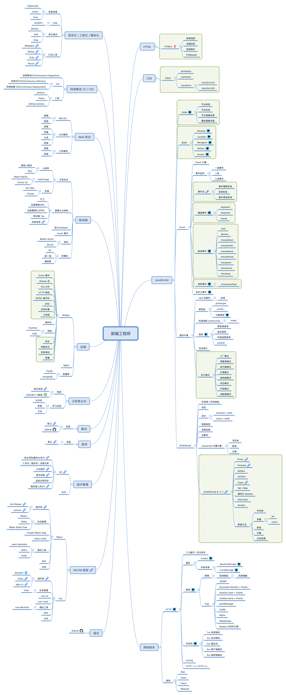

#### 路径

```html
<html>
    <body>
      <object type="image/svg+xml" data="../images/feer.svg"></object> 
    </body>
</html>
```

```html

```




#### 下载

[Xmind 下载地址](https://github.com/Rain120/study-notes/raw/master/docs/knowledge-map/%E9%AB%98%E7%BA%A7%E5%89%8D%E7%AB%AF%E5%B7%A5%E7%A8%8B%E5%B8%88.xmind)

