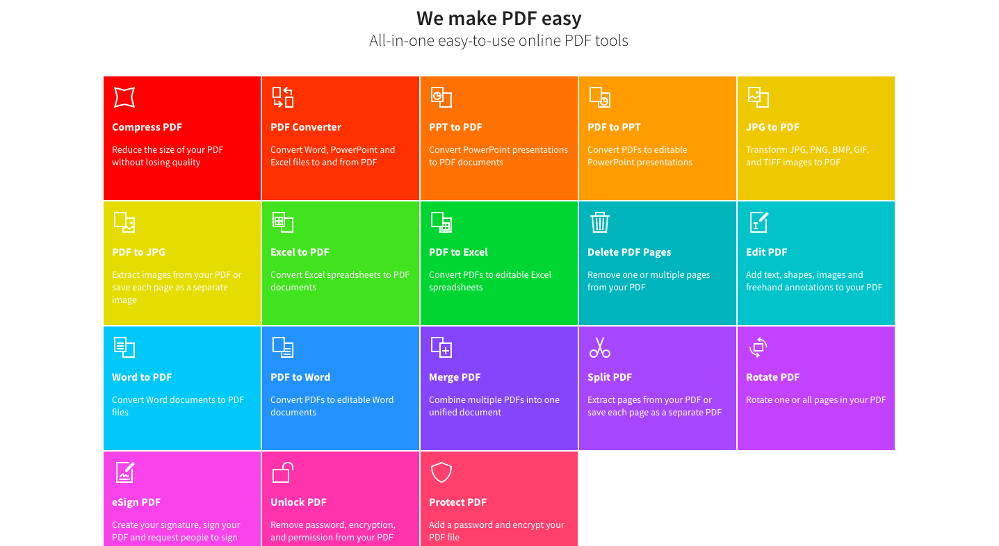
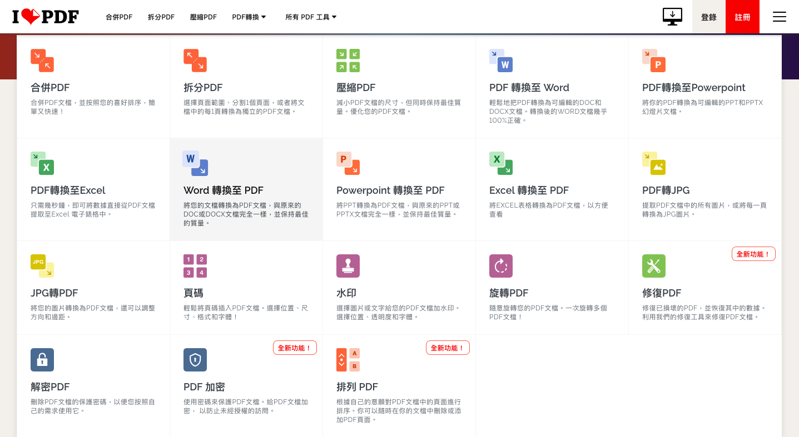

# 文件相关

文件快速分享

[FireFox Send](<https://send.firefox.com/>) [Github](<https://github.com/mozilla/send>)

[wenshushu](https://www.wenshushu.cn/): 极速传文件给他人 [Github](https://github.com/Aruelius/wenshushu)

[Airportal](https://airportal.cn/): 极速分享

文件格式转换

[SmallPDF](https://smallpdf.com/)

[ILovePDF](https://www.ilovepdf.com/zh-tw)

[CleverPDF](https://www.cleverpdf.com/cn)

[ExtractPDF.com](https://www.extractpdf.com/zh.html): `14M`

[迅捷PDF转换器](https://app.xunjiepdf.com/): 非会员`2M`文件

[pdf24](https://tools.pdf24.org/zh/): 免费且易于使用的在线 `PDF` 工具

[convertio.co](https://convertio.co/zh/): 支持多类的文件转换、小于100M的文件

[ffmpeg](http://ffmpeg.org/): 完整的跨平台解决方案，用于记录，转换和流传输音频和视频。
