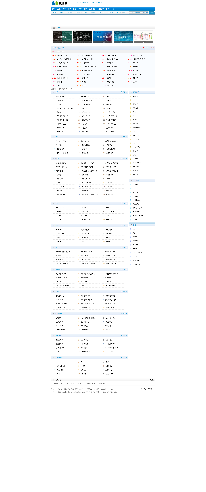

# 学习网站

## 英语

[微软小英写作网站](https://app.mtutor.engkoo.com/englishwriting/)

- **考试分类**

  覆盖8种考试类型，可根据自身需求选择不同评分标准

- **语法检查**

  AI技术自动检查拼写和语法错误，提供修改建议

- **图片识别**

  无须输入文字，可一键上传照片，自动识别作文内容

- **写作助手**

  单词不会拼，逻辑连接词用哪个，写作助手全搞定

[听力练习](https://www.voscreen.com/)

`Voscreen`通过简短的视频剪辑帮助您提高英语水平。 在`Voscreen`视频学习环境中，学习和提高英语比以往更加有趣。

## 综合

[中国大学MOOC](https://www.icourse163.org/)

中国大学`MOOC`是由网易与高教社携手推出的在线教育平台，承接教育部国家精品开放课程任务，向大众提供中国知名高校的`MOOC`课程。在这里，每一个有意愿提升自己的人都可以免费获得更优质的高等教育。

`MOOC`是`Massive Open Online Course`（大规模在线开放课程）的缩写，是一种任何人都能免费注册使用的在线教育模式。`MOOC`有一套类似于线下课程的作业评估体系和考核方式。每门课程定期开课，整个学习过程包括多个环节:观看视频、参与讨论、提交作业，穿插课程的提问和终极考试。

[壹课堂](http://www.1ketang.com/index.html)

一个非常强大的在线视频教程网站，所有的视频都是免费观看！你想要的学科这里都有，还可以直接搜索高校，找到你想要的学校的课程！

[frontendmasters](https://frontendmasters.com/)

通过深入的现代 `JavaScript` 和前端工程课程提高您的技能。

## 计算机

[openprocessing](https://www.openprocessing.org/)

在线学习编程网站

[慕课网](https://www.imooc.com/)

慕课网（`IMOOC`）是`IT`技能学习平台。慕课网(`IMOOC`)提供了丰富的移动端开发、`php`开发、`web`前端、`android`开发以及`html5`等视频教程资源公开课。

[oeasy](http://oeasy.org/)

提供的视频教程非常丰富并且质量很高，包括：`PS` 教程、手机摄影教程、`Ai `做图教程、`Excel `教程、`Word `教程、PPT 教程、`Pr` 视频剪辑教程、`Ae` 视频特效教程`、Au` 音频教程、`Flash` 教程、做网页教程、`css `样式教程、`js` 教程、`Cad` 制图教程、电路制作教程、`Windows `教程、色彩搭配教程、`Prezi `演示教程、`Keynote` 教程、做图标教程。

[2uts](https://2uts.com/)

一个完全免费的视频教程网站，它提供了丰富并且免费的高质量国外视频教程。

它提供的视频教程都是一些专业技能视频教程，包括：3D 和动画、Web 开发、程序设计、移动开发、设计与插图、游戏开发、视觉与视觉特效、音频制作。
