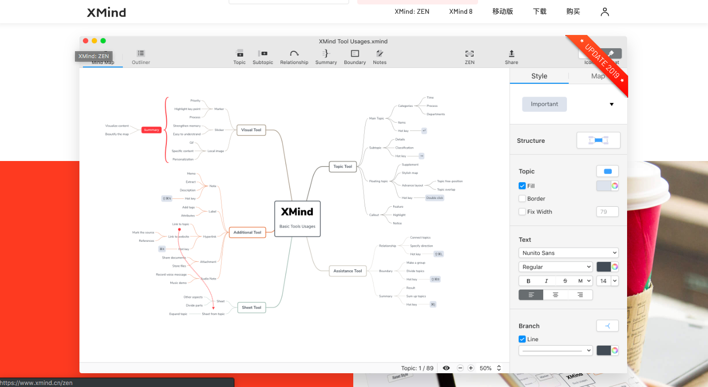
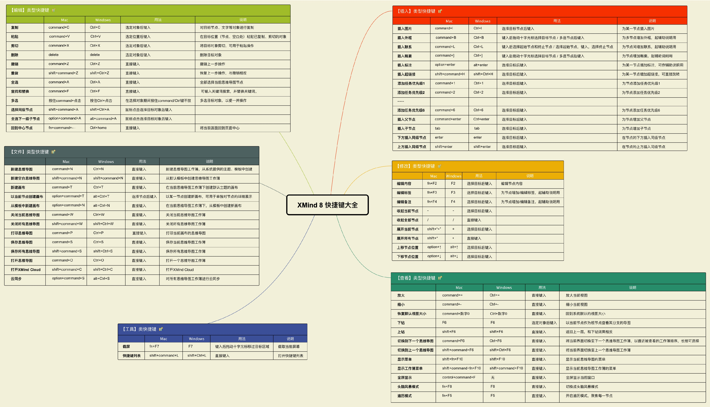
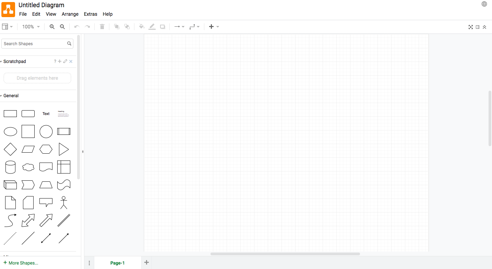
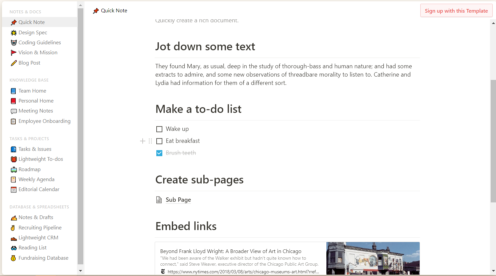

# 思维导图

[XMind](<https://www.xmind.cn/>)

快捷键

[Mindmeister](<https://www.mindmeister.com/zh>)

[visual-paradigm](https://online.visual-paradigm.com/): 直观的 **信息图表软件**

[Draw.IO](<https://www.draw.io/>)

[极品脑图](https://jpdaotu.com/)

[Notion](https://www.notion.so/?r=a8b6e24bd86f4597a0b26266f6f8aee9)

[Sketchboard](https://sketchboard.me/)

[幕布](https://mubu.com/)

[ASCII: 字符创建流程图](http://asciiflow.com/)

[gitmind](https://gitmind.cn/): 免费在线思维导图软件，简化逻辑梳理，集思广益，释放创造力在线脑图、思维导图、流程图、工业设计、工程管理，一图涵千面

[Excalidraw](https://excalidraw.com/): 手绘流程图

https://dai-shi.github.io/excalidraw-animate: excalidraw变成动画
