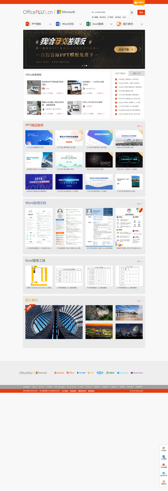
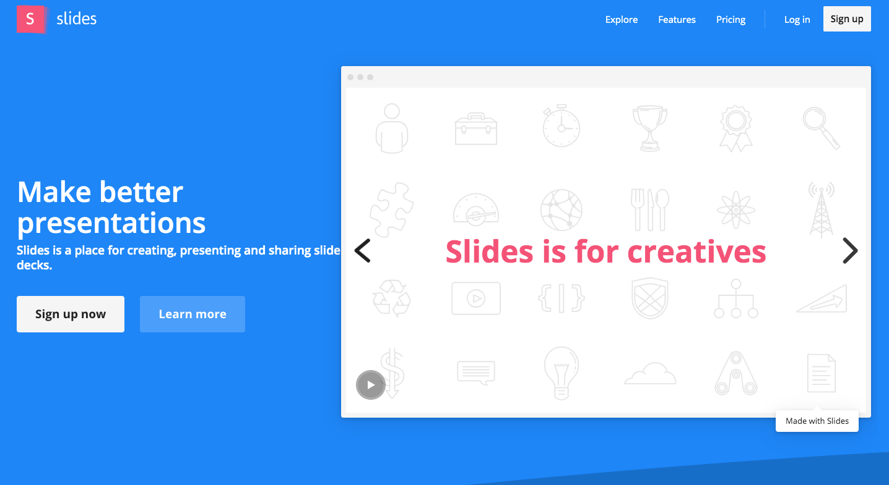

# Office相关

[OfficePLUS](http://www.officeplus.cn/Template/Home.shtml)

旨在为全球`Office`用户提供丰富的高品质原创`PPT`模板、实用文档、数据图表及个性化定制服务，帮助用户随时随地提升效率，成就更多。
也许您还为如何美化`PPT`而发愁，为排版和构架而烦恼，`OfficePLUS`将让您的困惑一扫而光。这里有行业内最优的原创模板，不仅设计精美，更针对用户不同的使用场景提供了清晰的逻辑架构以及非常灵活的排版和图表。大到背景图，小到每一个图标，都可以实现轻松自如的个性化设计，从此让`PPT`的制作变得轻松愉悦。

[声享PPT制作](https://ppt.baomitu.com/)

[PPT制作](<https://slides.com/>)

[方方格子](http://www.ffcell.com/index.aspx)

方方格子是一个专注于 `Excel `的综合学习网站，它不仅提供实用的 Excel` 插件和工具箱，还提供各种 ``Excel `学习教程。
