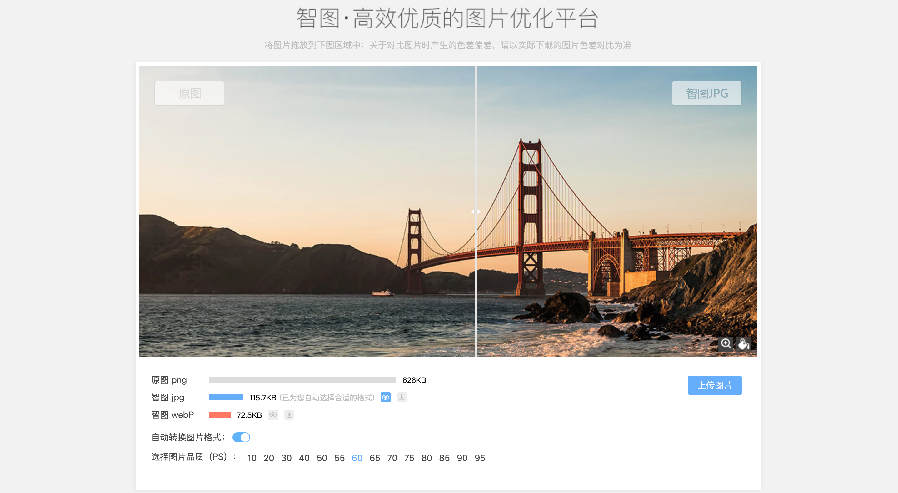

# 图片相关

[Retroooo Folks](https://www.manuelalangella.com/retroooo-folks/)

[Black illustrations](https://www.blackillustrations.com/)

[幕后](https://muhou.net/)

[unDraw](https://undraw.co/): 可免费使用的优质插图插画图片素材，并且可以自己定制主题颜色

[Unsplash](https://unsplash.com/)

[remove - 移除背景](https://www.remove.bg/)

[在线替换图片背景](https://www.gaoding.com/koutu)

[Pexels](https://www.pexels.com/)

这个网站提供免费的高质量图片！并且这些图片都是没有版权的。

[pngimg](http://pngimg.com/)

世界最大 `png` 透明背景图库推荐，两万张免费插图下载

[imagecyborg](https://imagecyborg.com/)

它的主要功能是帮助你下载网页上面的所有图像，它的使用方法同样非常简单，也是复制你要下载图片的对应网页链接到网站的输入框，点击下载图片按钮，就可以轻松下载对应网页的所有图片了。

它还支持下载在线视频，将网页转换为 PDF，将在线视频转换为 MP3 等功能。

[AI人工智能图片放大](https://bigjpg.com/)

使用最新人工智能深度学习技术——深度卷积神经网络(Deep Convolutional Neural Networks, based on [waifu2x](https://github.com/nagadomi/waifu2x))。它会将噪点和锯齿的部分进行补充，实现图片的无损放大

[Carbon](https://carbon.now.sh/)

[codeimg](https://codeimg.io/): 源代码生成图片工具

[码力全开](https://design.maliquankai.com/)

<iframe
    width="100%"
    height="500"
    src="https://design.maliquankai.com/">
</iframe>

### AI图片无损放大

使用最新人工智能深度学习技术——深度卷积神经网络。它会将噪点和锯齿的部分进行补充，实现图片的无损放大。

[letsenhance](https://letsenhance.io/)

注册可免费5张

[bigjpg](https://bigjpg.com/zh)

一款`AI`人工智能图片放大工具，它使用深度学习将图片中的噪点和锯齿进行补充，从而实现图片的修复和无损放大

[waifu2x](http://waifu2x.udp.jp/)

一个开源的图片放大工具，它使用卷积神经网络对动漫风格的图片和照片进行放大操作，支持网络图像和本地上传，最大可以支持到2倍放大，如果你对人工智能图片放大感兴趣，[Github](https://github.com/nagadomi/waifu2x)

[Smart upscaler](https://icons8.com/upscaler)

是由icons8推出的一款免费AI图片放大工具，它使用人工智能来放大和增强照片画质，让图片更加清晰。Smart upscaler 使用非常简单，无需注册，只要上传图片就能自动放大，并且会在网页上显示实时效果图，支持图形和照片类型图像，支持放到2倍到4倍，如果你希望照片放大的同时变得更加清晰，`Smart upscaler` 是一个非常好的选择

[pixfix](https://pixfix.com/)

 一款图片修复工具，它使用算法清理图片中的噪点和因压缩造成的图片损坏，上传图片后，你可以调节修复强度，并且实时预览图片的效果，直到满意后再下载图片

[UPSCALE PICS](https://upscalepics.com/)

一款照片放大工具，它使用AI算法来增强照片，可以在不降低画质的情况下放大图片，并图片增加更多细节，最大可以支持到8倍放大，`UPSCALE PICS` 目前还在测试中，需要注册后才能使用

### 图片压缩

[压缩图](https://www.yasuotu.com/): 在线处理图片的网站

[Recompressor](https://recompressor.com/): 一款免费图片最佳压缩工具，将图片拖曳到网页中就能处理，支持`.svg`、`.jpg` 和`.png `三种格式，和其他同类服务不同的是` Recompressor `会自动进行多种压缩，产生不同文档大小、压缩比和画质对比图，提供给使用者最佳的压缩结果建议。`Recompressor`使用上完全免费、无广告，压缩会在使用者浏览器的` JavaScript `中进行，图片不会上传到远端服务器，相当安全。压缩后会显示各种图片画质对应的文档大小、`RMSE` 和最大误差等数据，绘制成图表后更易于检视。

[Tinyjpg](https://tinyjpg.com/): 一次性可批量压缩最多20张不超过`5M`的`JPG`或者`PNG`图片，在线就可以使用。

[jpeg.io](https://www.jpeg.io/): 优点是支持压缩的格式特别多，连`PSD` 都可以压缩，不过压缩后的格式会统一为`JPG`。免费可打包下载。

[Optimizilla](https://imagecompressor.com/zh/)

优点：

- 在保证图像最佳画质前提下压缩率达40%-70%
- 支持多文件同时压缩，JPG/PNG均可同时存在
- 可以自定义画质来压缩图像
- 可即时对比预览效果图

[智图](https://zhitu.isux.us/): 智图是腾讯`ISUX`前端团队开发的一个专门用于图片压缩和图片格式转换的平台，其功能包括针对`png`,`jpeg`,`gif`等各类格式图片的压缩，以及为上传图片自动选择最优的图片格式。同时，智图平台还会为用户转换一份`webp`格式的图片。

[图好快](https://www.tuhaokuai.com/): 可以压缩静态图，还可以压缩`Gif`，还有一系列贴心的小功能：批量下载、加水印、格式转换，一键处理淘宝店图等等。

