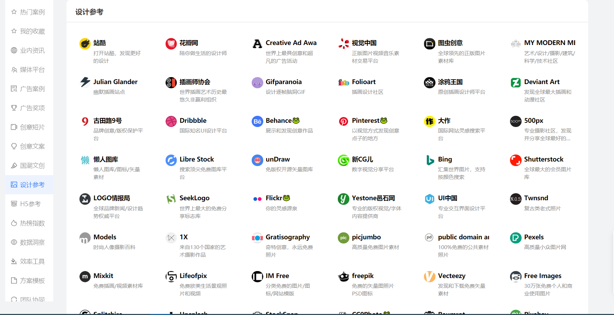

# 工具网站

## 开发相关

### 取色网站

[「颜值即正义」那些管UI小姐姐要来的网站](https://juejin.im/post/5e7cdee26fb9a03c6e640cc7)

[CSS3渐变效果工具](https://www.bestvist.com/css-gradient)

[flatuicolors](https://flatuicolors.com/)

[zhongguose](http://zhongguose.com/)

[Colourcode](https://colourco.de/)

可以自由配色，也能在色彩调和规则的限制下配色。Colourcode 的特色在于它的操控体验。

[Color Hunt](https://colorhunt.co/)

色板由用户自己创建，点赞高的色板自然会排在网页前面。这上面展示的配色方案还是挺好看的，毕竟它的用户很多都是专业设计师。

[这些实用的色彩工具，非设计师也能快速上手](https://sspai.com/post/43885)

**Digital Color Meter(macOS自带)** ： `Mac`直接数码取色器即可

## 设计相关

[Dribbble](https://dribbble.com/)

[Behance](https://www.behance.net/)

[配色分享](https://juejin.im/post/5e7cdee26fb9a03c6e640cc7)

[lookae](http://www.lookae.com/)

大众脸为您提供的后期技术交流平台

[seeseed](https://www.seeseed.com/)

你想知道设计**灵感**、**配色**、**字体**、**图标**等众多信息，它全都有。

[addog](http://www.addog.vip/)

[shapefactory](https://shapefactory.co/)

一个多功能设计网站，它提供了 `Logo `制作、配色推荐、渐变色推荐、双色调图片制作

[imgcook](https://imgcook.taobao.org/)

由设计稿一键智能生成代码

[videezy](https://www.videezy.com/)

免费下载 `4k`视频

## Icon 网站

[flaticon](https://www.flaticon.com/)

## Logo生成

[wuruihong](https://icon.wuruihong.com/): 启动图生成工具

[designmantic](https://www.designmantic.com/)

[brandmark](https://brandmark.io/): 生成的`logo`图标符号形状较多，造型简单，整体质量较好

[logosc](https://www.logosc.cn/) 在线付费`logo`制作设计网站，为企业定制`logo`

[凡科快图](https://kt.fkw.com/)

[canva](https://www.canva.cn/)

[创客贴](https://www.chuangkit.com/): 包含有海量海报、名片、PPT、简历、宣传单、易拉宝、邀请函、信息图表等设计模板

[懒设计](https://www.fotor.com.cn/): `Fotor`懒设计提供了适用于各种尺寸和应用场景的设计模板，包括国内外的主流社交媒体配图、电商平台配图，以及各种广告`banner`、朋友圈邀请函、海报设计等，用户也可根据设计需求，选择所需尺寸，然后从`Fotor`的海量模板素材中挑选合适的进行设计。

[图怪兽](https://818ps.com/): 一个在线ps图片编辑器,它相当于`ps`精简版,可提供微信公众号图文在线编辑、在线ps照片处理、在线拼图、在线设计、平面设计、海报制作、在线图片处理等功能

[sketchvalley](https://sketchvalley.com/): 手绘免费矢量图资源

[更多](https://zhuanlan.zhihu.com/p/46980463) `or` [这个](https://www.v1tx.com/post/best-online-graphic-design-tool/#artboard-studio)
