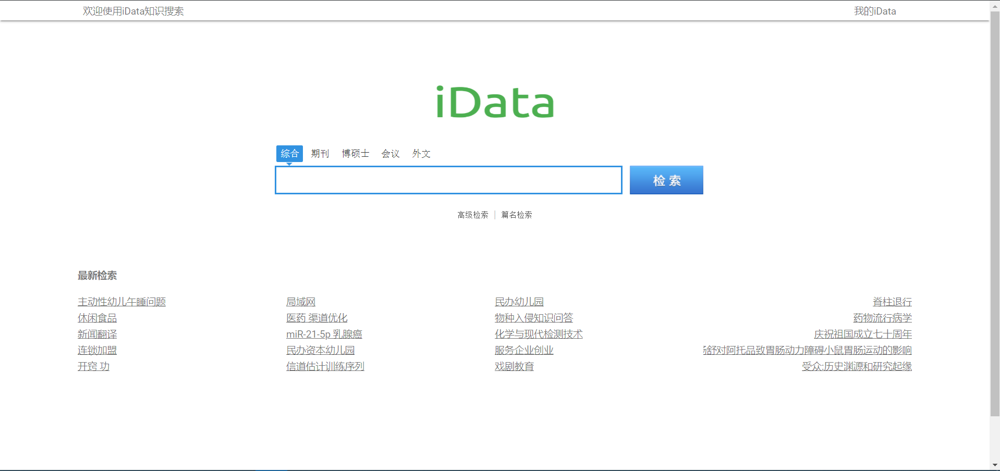
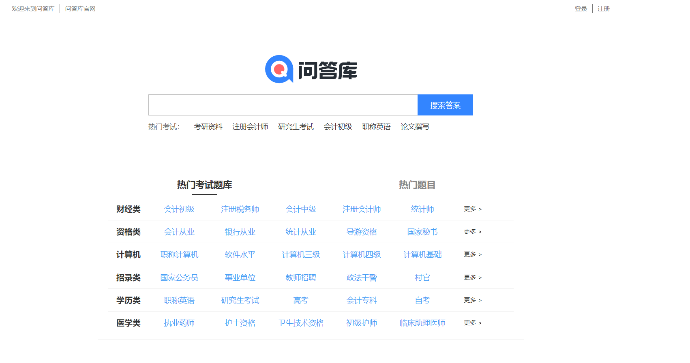
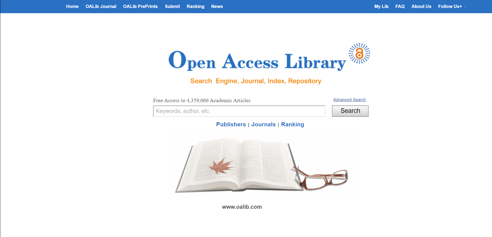
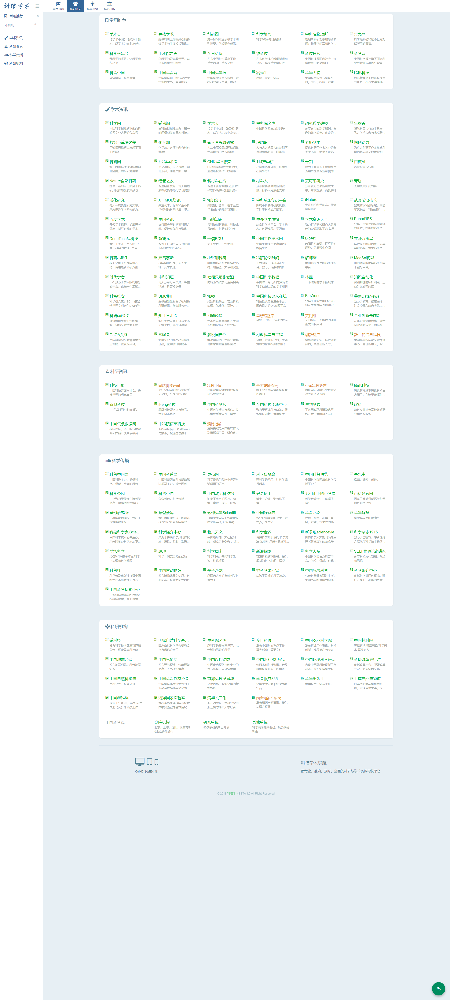

# 文献查找

[iData](https://www.cn-ki.net/)

`iData`是由北京大学、清华大学、浙江大学、复旦大学等师生学者共同筹建的用于教学、科研目的的公益互联网项目，旨在促进知识的传播和最新学术科技的共享。`iData`平台上所有信息均为公开发表的学术文献，由学者自由上传，并提供有限的免费浏览、下载服务。

[问答库](https://www.asklib.com/)

问答库一直致力于让所有的互联网用户更便捷的寻找到常见问题的答案，让大家更好的学习和提高自己。问答库收录了数百万的公务员考试，建筑工程，`IT`认证，资格考试，会计考试，医药考试，外语考试，外贸考试，学历考试以及一些常见的普通练习的题目供大家查询。

[OALib/免费论文搜索引擎](http://www.oalib.com/)

学术论文存储超过420万篇，涵盖所有领域而且全部**免费下载！**比`iData`还好用！而且还跟国内外诸多大学合作！可以直接搜索你想要的宝藏文章！

[科塔学术](https://site.sciping.com/)

学术搜索、文献数据、共享资源、学术标准、人才计划、专利标准！

[Library Genesis](http://gen.lib.rus.ec/)

它不仅可以免费下载文献，还能免费下载很多外文书籍，且 Library Genesis 几乎每天都在更新。可以随意下载 80 多万本图书的网站，其中 99% 是难以买到的科学著作！

[墙内Google学术](http://ac.scmor.com/)

[爱学术](https://www.ixueshu.com/) **会员制**

爱学术旨在构建一个专业的学术文献交流分享平台。我们将精心挑选有影响力,有特色的机构和学者,为广大用户提高有价值的可利用的学术文献.同时,我们也会帮助认证机构展示擅长领域给广大用户,提升机构的影响力,活跃用户.我们也会竭力提供一个良好学术生态圈,让用户分享和交流自己的学术成果,发现更有价值的学术科研信息,获得分享和交流的乐趣和满足感.

~~[免费知网、维普下载方式](http://210.47.0.21/~root/user?from_link=%2F)~~

* ~~账号：cclglib~~
* ~~密码：cclglib~~

[浙江图书馆](https://mp.weixin.qq.com/s/227_l0xNa85n1U9evAe6_A)

网站｜万方、知网、维普、超星学术论文免费下载，杂志期刊免费看

~~[SciHub 桌面版](https://www.appinn.com/sci-hub/)~~
有点久，不知道还行不行

[http://sci-hub.tw/](http://sci-hub.tw/)

[http://sci-hub.se/](http://sci-hub.se/)

[http://sci-hub.si/](http://sci-hub.si/)

[hejizhan](http://www.hejizhan.com/bbs/)

万千合集站是一个质量很高的论文，文档搜索网站。

它支持的学科非常丰富，包括：数学、物理学、化学、天文学、地球科学、生物科学、心理学、计算机科学与技术、医药卫生、管理学、语言和文字、艺术学、经济学、法律与社会、科普与百科，并且大部分文档都是支持直接免费下载的。
