## 版本

-   `Iterm2` **3.3.12**

## 修改默认终端

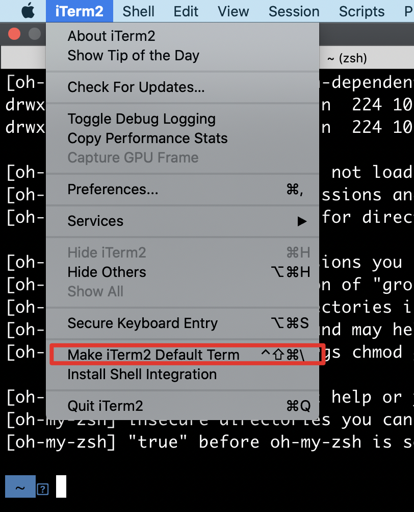

```sh
chsh -s /bin/zsh
```

默认是配置

```sh
chsh -s /bin/bash
```

## Iterm2 配置

### Status Bar 配置


### 命令左右跳转配置(option(⌥) ← / →)

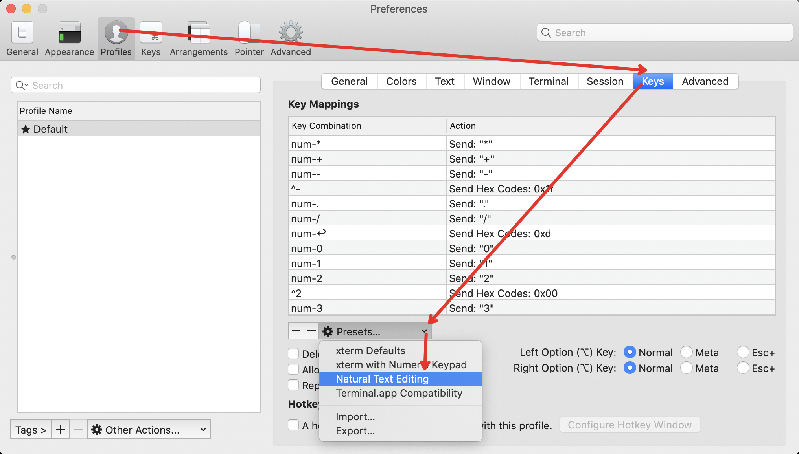

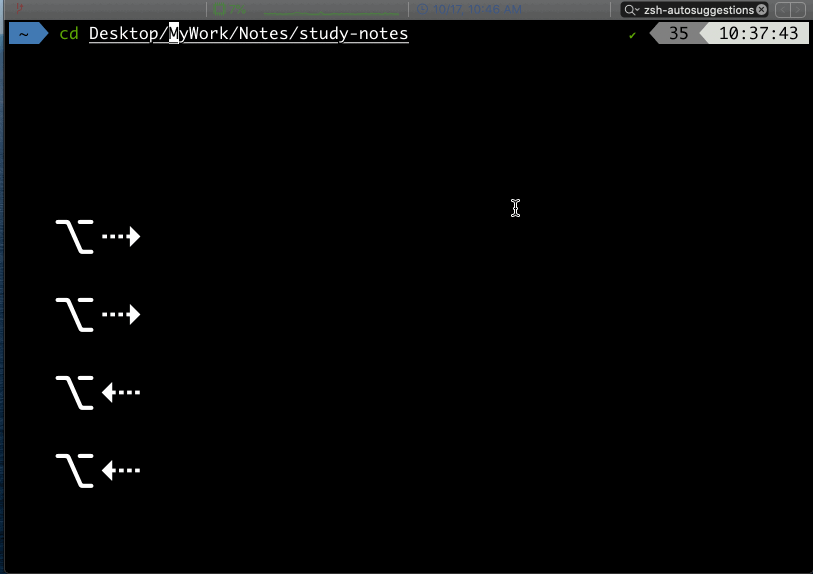

[stackoverfloe QA](https://stackoverflow.com/questions/6205157/iterm-2-how-to-set-keyboard-shortcuts-to-jump-to-beginning-end-of-line)

### Vim 鼠标滚动

`preferences -> Advanced -> Mouse -> scroll(up / down)`

-   `down -> \j`

-   `up -> \k`

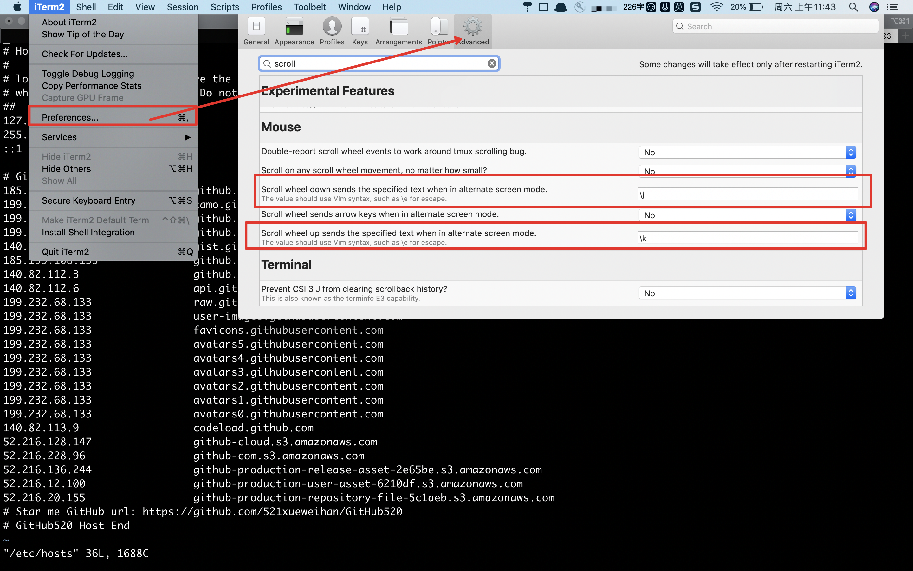

## 安装 oh my zsh

```sh
# curl
sh -c "$(curl -fsSL https://raw.github.com/ohmyzsh/ohmyzsh/master/tools/install.sh)"

# wget
sh -c "$(wget https://raw.github.com/ohmyzsh/ohmyzsh/master/tools/install.sh -O -)"

# clone
git clone git@github.com:ohmyzsh/ohmyzsh.git ~/.oh-my-zsh
cp ~/.oh-my-zsh/templates/zshrc.zsh-template ~/.zshrc
touch ~/.bash_profile
```

官方链接 👉👉👉 [`Here`](https://ohmyz.sh/#install)

## 安装字体

```sh
# clone
git clone https://github.com/powerline/fonts.git --depth=1
# install
cd fonts
./install.sh
# clean-up a bit
cd ..
rm -rf fonts
```

官方链接 👉👉👉 [`Here`](https://github.com/powerline/fonts#quick-installation) 或者使用它 [`nerd-fonts`](https://github.com/ryanoasis/nerd-fonts)。

安装字体前

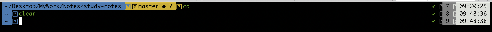

安装字体

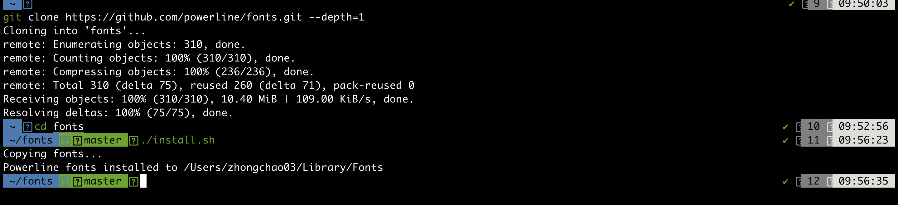

配置 & 安装字体后

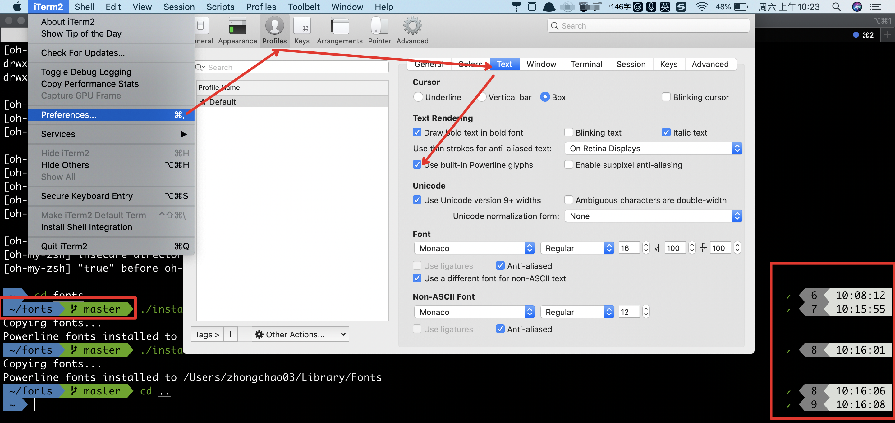

## 配置 Status Bar

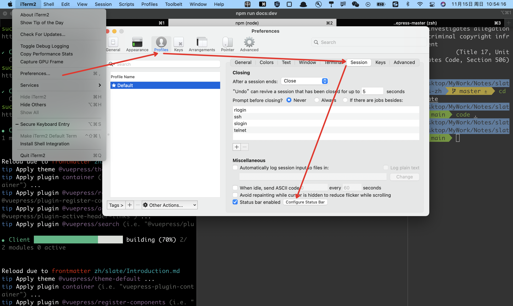

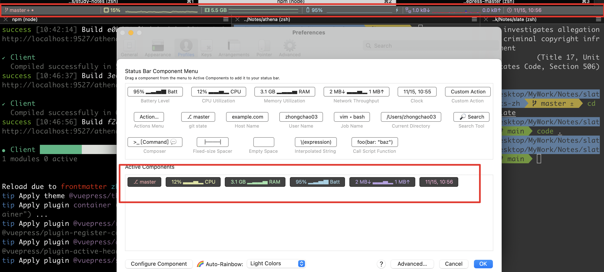

## 下载插件

### 插件配置

```sh
# plugins=(extension1 extension2 ....)
plugins=(
  git
  z
  zsh-autosuggestions
  zsh-syntax-highlighting
)
```

### 提示插件: zsh-autosuggestions

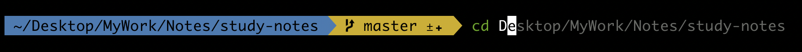

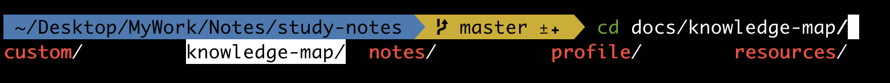

```sh
cd ~/.oh-my-zsh/custom/plugins/
git clone https://github.com/zsh-users/zsh-autosuggestions

```

## 高亮插件: zsh-syntax-highlighting


```sh
cd ~/.oh-my-zsh/custom/plugins/
git clone https://github.com/zsh-users/zsh-syntax-highlighting.git
```

高亮插件需要保证插件在最后面，然后在`.zshrc` 的最下面配置这个，保证生效

```sh
source ~/.oh-my-zsh/custom/plugins/zsh-syntax-highlighting/zsh-syntax-highlighting.zsh
```

## `Enable` 配置文件

```sh
source ~/.zshrc
```

## 去除 oh my zsh 提示

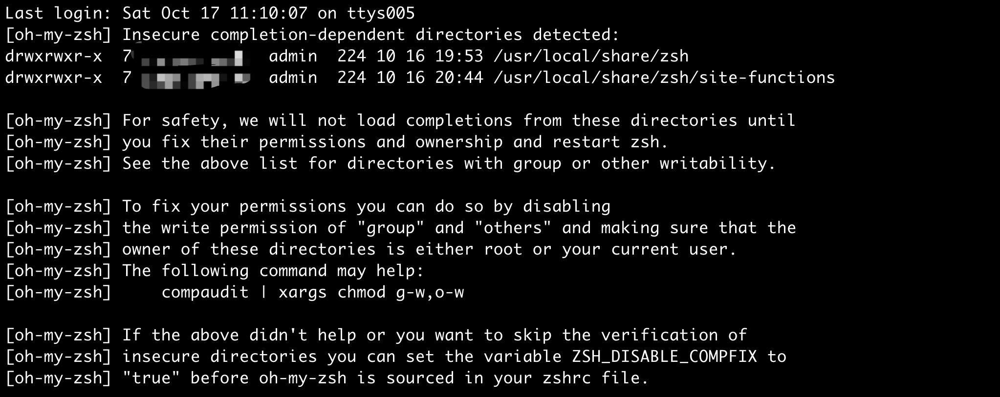

### 方法 1

```sh
chmod 755 /usr/local/share/zsh
chmod 755 /usr/local/share/zsh/site-functions
```

看提示告诉我们那个文件没有权限，给他加上即可

### 方法 2

```sh
# .zshrc 第一行
ZSH_DISABLE_COMPFIX="true"
```

## FBI Warning

> 装逼专用，但是真的好无聊的，不建议


```sh
# .zshrc 新增内容
# FBI Warning
export PATH="$PATH:$HOME/.rvm/bin" # Add RVM to PATH for scripting

_COLUMNS=$(tput cols)
_MESSAGE=" FBI Warining "
y=$(( ( $_COLUMNS - ${#_MESSAGE} )  / 2 ))
spaces=$(printf "%-${y}s" " ")

echo " "
echo -e "${spaces}\033[41;37;5m FBI WARNING \033[0m"
echo " "
_COLUMNS=$(tput cols)
_MESSAGE="Ferderal Law provides severe civil and criminal penalties for"
y=$(( ( $_COLUMNS - ${#_MESSAGE} )  / 2 ))
spaces=$(printf "%-${y}s" " ")
echo -e "${spaces}${_MESSAGE}"

_COLUMNS=$(tput cols)
_MESSAGE="the unauthorized reproduction, distribution, or exhibition of"
y=$(( ( $_COLUMNS - ${#_MESSAGE} )  / 2 ))
spaces=$(printf "%-${y}s" " ")
echo -e "${spaces}${_MESSAGE}"

_COLUMNS=$(tput cols)
_MESSAGE="copyrighted motion pictures (Title 17, United States Code,"
y=$(( ( $_COLUMNS - ${#_MESSAGE} )  / 2 ))
spaces=$(printf "%-${y}s" " ")
echo -e "${spaces}${_MESSAGE}"

_COLUMNS=$(tput cols)
_MESSAGE="Sections 501 and 508). The Federal Bureau of Investigation"
y=$(( ( $_COLUMNS - ${#_MESSAGE} )  / 2 ))
spaces=$(printf "%-${y}s" " ")
echo -e "${spaces}${_MESSAGE}"

_COLUMNS=$(tput cols)
_MESSAGE="investigates allegations of criminal copyright infringement"
y=$(( ( $_COLUMNS - ${#_MESSAGE} )  / 2 ))
spaces=$(printf "%-${y}s" " ")
echo -e "${spaces}${_MESSAGE}"

_COLUMNS=$(tput cols)
_MESSAGE="(Title 17, United States Code, Section 506)."
y=$(( ( $_COLUMNS - ${#_MESSAGE} )  / 2 ))
spaces=$(printf "%-${y}s" " ")
echo -e "${spaces}${_MESSAGE}"
echo " "
```

## 全部配置

`.zshrc`

```sh
ZSH_DISABLE_COMPFIX="true"

export ZSH="$HOME/.oh-my-zsh"

# See https://github.com/ohmyzsh/ohmyzsh/wiki/Themes
# ZSH_THEME="robbyrussell"
ZSH_THEME="agnoster"

plugins=(
  git
  z
  zsh-autosuggestions
  zsh-syntax-highlighting
)

source $ZSH/oh-my-zsh.sh

# git alias
alias gs="git status"
alias gsm="git summary"
alias ga='git add .'
alias gaa='git add .'
alias gd='git diff'
alias gf='git fetch'
alias grv='git remote -v'
alias grb='git rebase'
alias gbr='git branch'
alias gpl="git pull"
alias gps="git push"
alias gco="git checkout"
alias gl="git log"
alias gc="git commit -m"
alias gcam="git commit --amend -m"
alias gm="git merge"
alias gpma="git pull origin master"
alias git='LANG=en_US git'
alias gfo='git fetch origin'
alias gfu='git fetch upstream'

# alias for push icode
alias i='pnpm i'
alias ai='pnpm api:install'
alias b='pnpm build'
alias c='code .'
alias cls='clear'
alias s='pnpm start || pnpm dev'
alias d='pnpm dev || pnpm start'
alias ss='pnpm run start'
alias ds='pnpm run dev'
alias wst='w2 start'
alias wsp='w2 stop'

alias pv7='npm i -g pnpm@7.11.0 --force'
alias pv6='npm i -g pnpm@6.35.1 --force'
alias pv='pnpm -v'
alias nv='node -v'
alias kn='killall node'
alias k9='kill -9'

# remove user host and pc name
DEFAULT_USER=$USER

source ~/.oh-my-zsh/custom/plugins/zsh-syntax-highlighting/zsh-syntax-highlighting.zsh

export PNPM_HOME="/Users/bytedance/Library/pnpm"
export PATH="$PNPM_HOME:$PATH"

test -e "${HOME}/.iterm2_shell_integration.zsh" && source "${HOME}/.iterm2_shell_integration.zsh" || true

# pnpm
export PNPM_HOME="/Users/bytedance/Library/pnpm"
export PATH="$PNPM_HOME:$PATH"
# pnpm end
```

其他的看看这个吧 [`here`](https://juejin.im/post/6844904178075058189)
