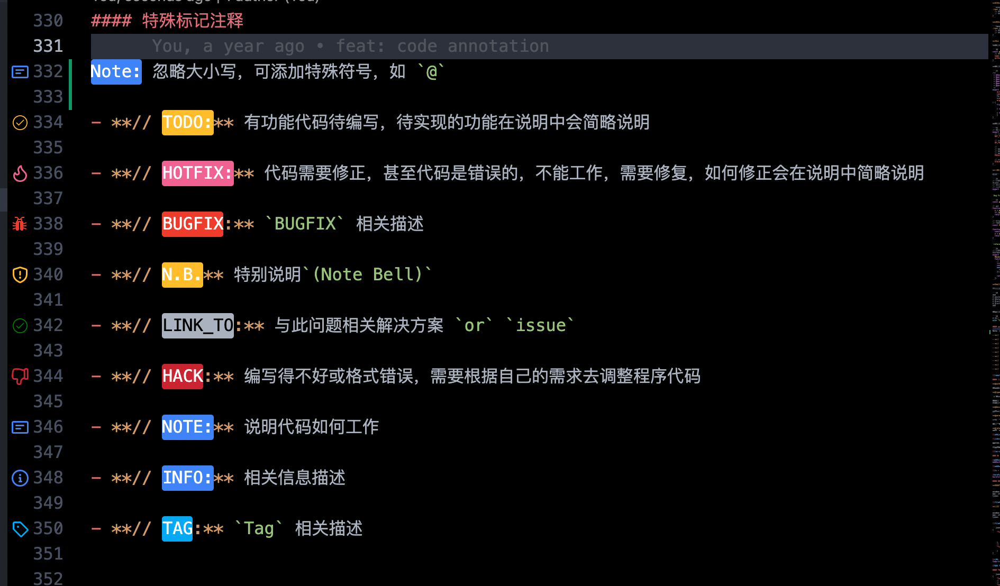

### VS Code 配置

```json
{
  // TODO Tree Setting
    // "todo-tree.regex.regex": "((//|#|<!--|;|/\\*|^)\\s*(@?)($TAGS):|^\\s*- \\[ \\])",
    // INFO: (@?) 这里可添加一些特殊符号
    "todo-tree.regex.regex": "(//|#|<!--|;|/\\*|^|^\\s*(-|\\d+.))\\s*",
    // INFO: 忽略大小写
    "todo-tree.regex.regexCaseSensitive": false,
    "todo-tree.tree.autoRefresh": true,
    "todo-tree.general.tags": [
        "TODO:",
        "HOTFIX:",
        "BUGFIX",
        "DONE:",
        "NOTE:",
        "INFO:",
        "LINK_TO",
        "TAG",
        "N.B.",
        "HACK",
        "[ ]",
        "[x]"
    ],
    "todo-tree.highlights.defaultHighlight": {
        "gutterIcon": true
        // "type": "text-and-comment"
    },
    // icon: https://microsoft.github.io/vscode-codicons/dist/codicon.html
    "todo-tree.highlights.customHighlight": {
        "[ ]": {
            "background": "#F44336"
        },
        "[x]": {
            "background": "#00de00"
        },
        "TODO:": {
            "foreground": "#fff",
            "background": "#ffbd2a",
            "iconColour": "#ffbd2a",
        },
        "HOTFIX:": {
            "foreground": "#fff",
            "background": "#f06292",
            "icon": "flame",
            "iconColour": "#f06292"
        },
        "DONE": {
            "background": "#2BBE4E",
            "icon": "issue-closed",
            "rulerColour": "#2BBE4E",
            "iconColour": "#2BBE4E"
        },
        "INFO:": {
            "foreground": "#fff",
            "background": "#3f83f8",
            "icon": "info",
            "iconColour": "#3f83f8"
        },
        "LINK_TO:": {
            "foreground": "#fff",
            "background": "#3f33f8",
            "icon": "info",
            "iconColour": "#3f33f8"
        },
        "NOTE:": {
            "foreground": "#fff",
            "background": "#3f83f8",
            "icon": "note",
            "iconColour": "#3f83f8"
        },
        "TAG": {
            "foreground": "#fff",
            "background": "#03A9F4",
            "icon": "tag",
            "rulerColour": "#03A9F4",
            "iconColour": "#03A9F4",
            "rulerLane": "full"
        },
        "BUGFIX": {
            "foreground": "#fff",
            "background": "#ee3c2c",
            "icon": "bug",
            "rulerColour": "#ee3c2c",
            "iconColour": "#ee3c2c",
            "rulerLane": "full"
        },
        "N.B.": {
            "foreground": "#fff",
            "background": "#ffbd2a",
            "icon": "shield",
            "rulerColour": "#ffbd2a",
            "iconColour": "#ffbd2a",
            "rulerLane": "full"
        },
        "HACK": {
            "foreground": "#fff",
            "background": "#cb2431",
            "icon": "thumbsdown",
            "rulerColour": "#cb2431",
            "iconColour": "#cb2431",
            "rulerLane": "full"
        }
    },
}
```


